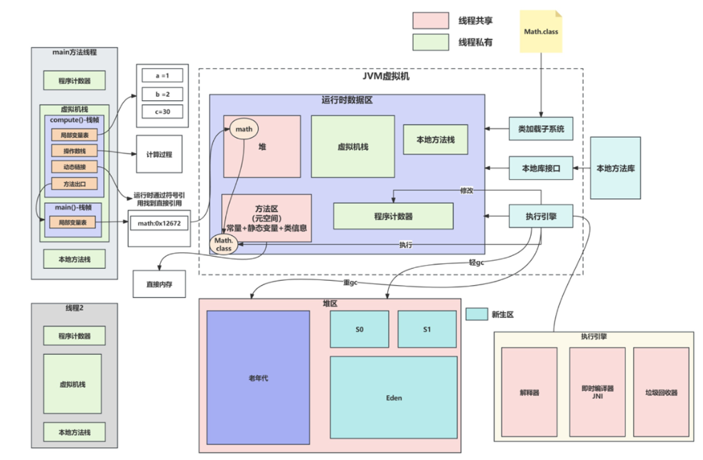

# JVM相关

## 1.JVM内存模型

jvm的内存分布：堆区、方法区、栈区、本地方法栈、程序计数器 3+2

程序计数器：线程私有的，记录当前线程执行的字节码文件编号，执行引擎通过字节码文件来选择下一句需要执行的字节码指令

虚拟机栈：线程私有，一个方法为一个栈帧，里面包括

- 局部变量表
- 操作数栈：计算的过程
- 动态链接：运行的时候通过符号引用找到直接地址
- 方法出口：直接指向下一个栈帧

本地方法栈：线程私有，调用的本地方法

堆区：线程共享，存放对象的实例，堆区通常被划分为老年区和新生区

- 新生区包括Eden区和S0、S1区，对象通常先放到Eden区
- 老年区：主要存放存活时间较长的对象

方法区：线程共享，主要存放的静态变量、类的信息、常量

## 2.类加载过程

双亲委派+三个过程

类加载的过程，需要类加载器，一共有三种类加载器

- 应用程序加载器：加载类路径文件下的.class
- 扩展类加载器:加载jdk中ex目录下的.class
- 引导类加载器：加载jdk中lib目录下的.class

双亲委派：首先会确定用什么类加载器加载，这个过程会逐层向上传递，应用程序加载器委托扩展类加载器，扩展类加载器委托引导类加载器，如果加载不到，再次向下委托

类加载的五个过程：

- 加载
  - 通过全限定类名，类加载器将.class文件加载到内容
  - 在内存中生成一个代表该类的java.lang.Class对象，作为方法区这些数据的访问入口
- 链接：
  - 验证：验证字节码文件的准确性，是否满足JVM虚拟机的规范
  - 准备：给类中的静态变量分配空间、赋默认值
  - 解析：静态链接的过程，把类中的符号引用转换为直接引用
- 初始化：
  - 为类的静态变量赋予正确的初始值，执行静态初始代码块和静态变量赋值的操作

## 3.GC相关

