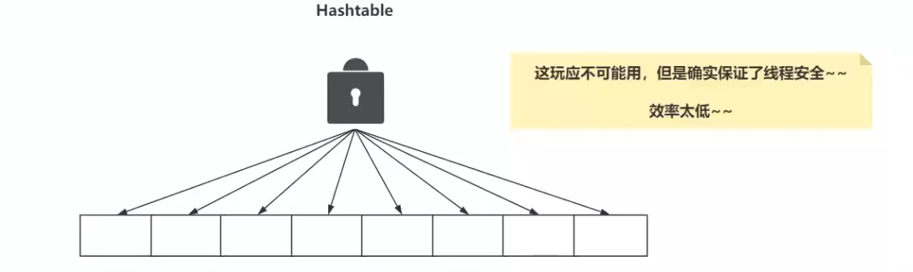
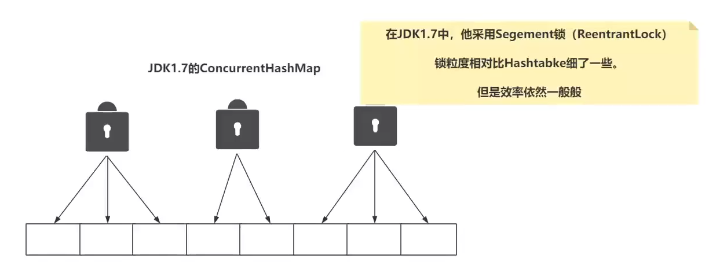
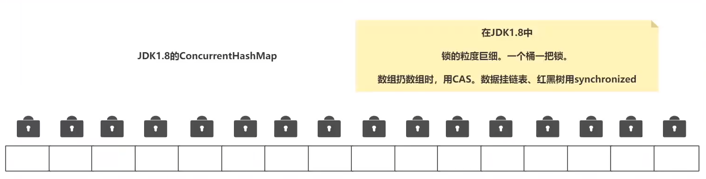
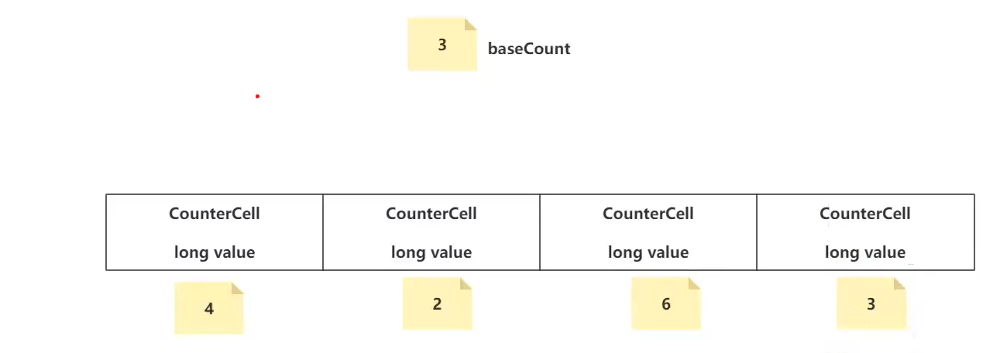

# Java基础相关

## 1.HashMap相关

HashMap和ArrayList相关

### HashMap的基础参数：

桶树化的阈值：64

链表树化的阈值：8

树链表化的阈值：6（红黑树的长度低于6）

装载因子：0.75

初始化容量：16*0.75 = 12

扩容机制：两倍扩容

### HashMap的底层数据结构：

JDK1.7：数组+链表 采用对链表的头插法解决hash冲突

- 采用头插法解决冲突

JDK1.8：数组+链表+红黑树

- 在链表的尾部插入解决冲突
- 树化条件
  - 链表长度大于8
  - hash桶的长度大于64

### HashMap的put流程

首次插入会进行初始化一个：HashMap的长度为16*0.75 = 12

先根据key计算出hash值，进行hash扰动得到新的hash值，新hash &（length-1） 计算出hash桶的下标

桶是否为空

- 为空：直接插入
- 不为空：
  - 是红黑树节点，添加或者更新，判断是否满足扩容阈值，扩容
  - 不是红黑树节点：从头开始遍历链表节点，更新或者添加，插入链表的尾部，判断是否需要扩容


### HashMap的扩容机制

明确：首次添加元素和非首次添加元素

- 首次添加元素：
  - 懒加载机制：16*0.75进行扩容
- 非首次添加元素：
  - 红黑树节点插入之前，会判断是否需要扩容
  - 节点插入之后，也会判断是否需要扩容

扩容的流程：

计算下标：hash&oldcap 相当于高的一位参与计算，如果是0，还是在原来的位置，如果是1，相当于原来的位置+容量

## 2.ConcurrentHashMap相关

### 2.1 CHM转红黑树的时机

什么时刻链表转红黑树条件

- 链表的长度大于8，当插入第9个Node的时候，才会触发链表转红黑树
- 数组的长度必须大于等于64，否则在转红黑树之前，会先扩容

为什么参数是8和64？

- 这个参数是不好修改的，8和64在底层源码里面中，基于泊松分布，造成链表转红黑树的概率很低0.0000006（好像）
- 修改8
  - 大于8，链表的长度过长，查询的效率低
  - 小于8，可能出现红黑树，红黑树的维护成本较高
- 修改64
  - 大于64，红黑树出现的概率变低，可能造成资源的浪费
  - 小于64，红黑树出现的概率增大，需要维护红黑树

### 2.2 CHM的扩容时机

两处地方涉及扩容：

- 链表长度大于8并且数组的长度小于64，优先扩容
- 数组里面的元素个数大于 扩容阈值，扩容阈值 = 数组长度*负载因子(0.75)

负载因子 0.75

- 源码里面规定的，CHM不可以修改，HashMap可以修改
  - 0.5 数组空间只有一半。可能有资源的浪费
  - 1 数组的利用率很高，链表可能会更长一点

### 2.3 CHM的DCL操作

DCL：doule check lock （双端检锁）

DCL操作主要是出现初始化hash数组的时候,确保初始化的数组是单例的

第二次检测的目的：可能会有多个线程通过第一个检测的条件

```java
    private final Node<K,V>[] initTable() {
        Node<K,V>[] tab; int sc;
        while ((tab = table) == null || tab.length == 0) { //check 数组是不是空，未初始化
            if ((sc = sizeCtl) < 0) // sizeCtl = -1 表示有线程初始化
                Thread.yield(); // 让出cpu
            else if (U.compareAndSwapInt(this, SIZECTL, sc, -1)) { //CAS 自旋 修改SIZECTL为 -1 
                try {
                    if ((tab = table) == null || tab.length == 0) { //check 数组是不是空，未初始化
                        int n = (sc > 0) ? sc : DEFAULT_CAPACITY;
                        @SuppressWarnings("unchecked")
                        Node<K,V>[] nt = (Node<K,V>[])new Node<?,?>[n];
                        table = tab = nt;
                        sc = n - (n >>> 2);
                    }
                } finally {
                    sizeCtl = sc;
                }
                break;
            }
        }
        return tab;
    }
```

### 2.4 CHM的散列算法

根据hashCode确定索引位置 hash&（n-1） hash&（000000000 00000000 00000000 000001111）

这样容易造成hash冲突，将高16位和低16位进行异或，之后在&（n-1）

### 2.5 CHM的并发安全

HashTable中，将所有的数组使用同一把锁，锁住。



在JDK1.7中的CHM

把锁的粒子细化了一个，一个锁管理三四个hash槽位，使用的是分段锁



在JDK1.8中的CHM

**锁的粒度巨细，一个桶一把锁，数据扔数组的时候使用CAS，数据挂链表、红黑树使用synchronized**



```java
 else if ((f = tabAt(tab, i = (n - 1) & hash)) == null) {
        if (casTabAt(tab, i, null,new Node<K,V>(hash, key, value, null))) //基于CAS，失败自旋
            break;                   // no lock when adding to empty bin
        }
        else if ((fh = f.hash) == MOVED)
        tab = helpTransfer(tab, f);
        else {
        V oldVal = null;
        synchronized (f) {} //数据要挂到了链表或者红黑树上
            
        }
```

### 2.6 CHM计数器的实现

计数器就是CHM记录元素的个数

新增+1 删除-1 还要保证线程安全

在JUC包下，提供了常规的保证线程安全的原子类，Atomic原子类，底层是CAS

但是CHM没有使用Atomic原子类，用的是LongAdder，**`Atomic底层使用的do-while和CAS循环`**浪费时间片

```java
public final int getAndAddInt(Object var1, long var2, int var4) {
        int var5;
        do {
            var5 = this.getIntVolatile(var1, var2);
        } while(!this.compareAndSwapInt(var1, var2, var5, var5 + var4));

        return var5;
    }
```

LongAdder的设计类似分段锁的效果，不用一个属性值记录元素的总数，而是使用多个属性值来记录，多个线程同时++ -- 的操作时候，会生成一个随机数，去随机找一个countercell数组做cas，就避免了避免了CAS的频繁失败

CounterCell数组，线程使用不同的countercell进行CAS



### 2.7 size的计算

baseCount 和 全部的counterCell想加即可

返回的并不是精确的数字，不保证强一致，执行size方法的时候，线程可能还在执行插入和删除

```java
final long sumCount() {
        CounterCell[] as = counterCells; CounterCell a;
        long sum = baseCount;
        if (as != null) {
            for (int i = 0; i < as.length; ++i) {
                if ((a = as[i]) != null)
                    sum += a.value;
            }
        }
        return sum;
    }
```


## 3.String相关

 ==和equals
