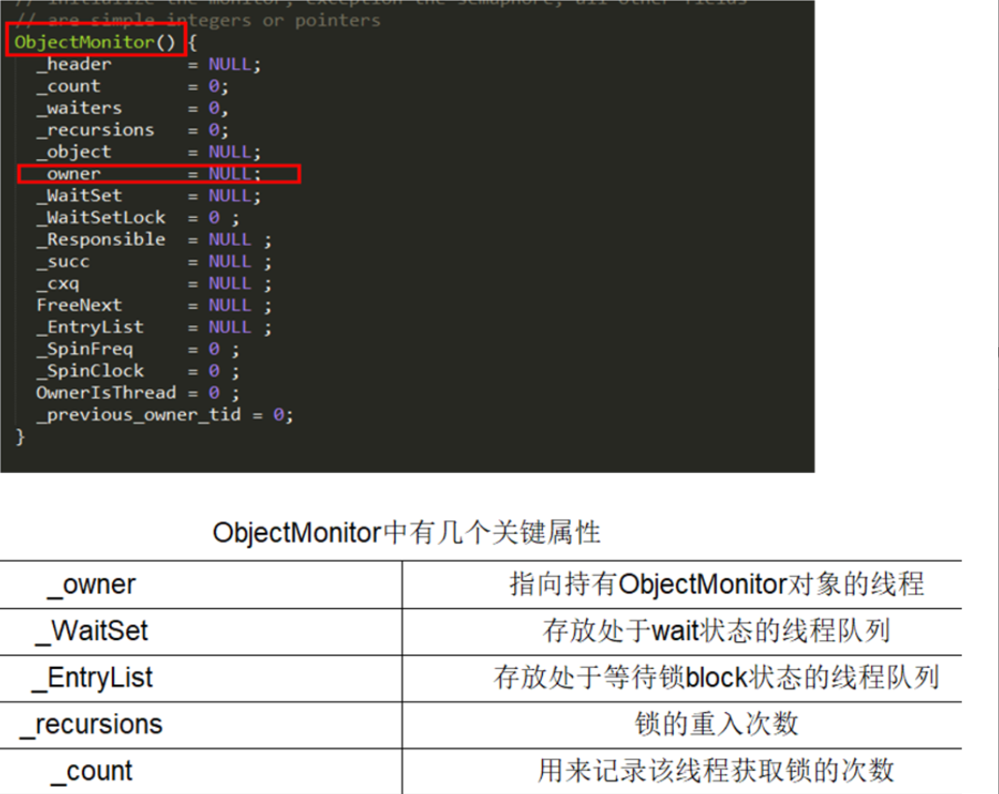
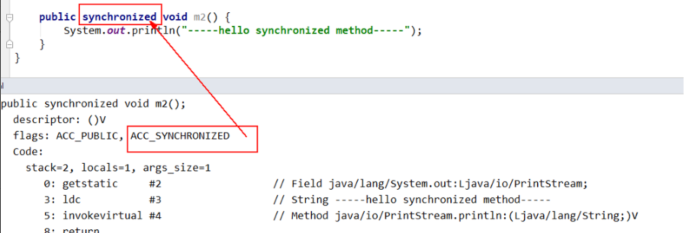
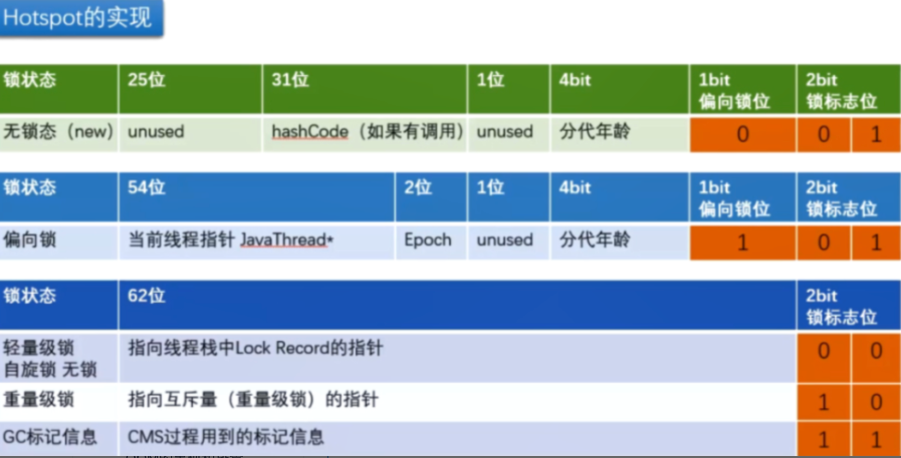

# Java并发相关

## 1.Synchronized的底层原理

**同步代码块、同步方法、静态同步方法**

### 1.1 同步代码块

- 同步块代码

  ```java
  public class SynchronizedDemo {   
    public void method() {       
      synchronized (this) {           
        System.out.println("synchronized 代码块");       
      }    
    } 
  }
  ```

反编译的

通过`javap -c xxx.class` 进行反编译（假如你需要更多信息`javap -v ***.class`文件反编译）

底层通过使用的是**monitorenter和monitorexit指令实现**。当执行 monitorenter 指令时，线程试图获取锁也就是获取 **对象监视器 monitor** 的持有权，获取锁之后，锁计数器+1。

对象锁的的拥有者线程才可以执行 monitorexit 指令来释放锁。在执行 monitorexit 指令后，将锁计数器设为 **0**，表明锁被释放，其他线程可以尝试获取锁。

Java 虚拟机(HotSpot)中，Monitor 是基于 C++实现的，由ObjectMonitor实现，其中有个字段为**owner表示持有管程的线程**



### 1.2 同步方法

反编译一下同步方法



原理：使用`ACC_SYNCHRONIZED `标识，JVM 会尝试获取**实例对象的锁**，相当于获取实例对象的monitor

### 1.3 静态同步方法

`ACC_STATIC, ACC_SYNCHRONIZED`访问标志区分该方法是否静态同步方法，JVM 会尝试获取当前 Class 的锁,对象监视器

------

**不过本质都是对对象监视器 monitor 的获取。**

- 同步代码：通过moniterenter、moniterexit 关联到到一个monitor对象，进入时设置Owner为当前线程，计数+1、退出-1。除了正常出口的 monitorexit，还在异常处理代码里插入了 monitorexit。
- 实例方法：隐式调用moniterenter、moniterexit
- 静态方法：隐式调用moniterenter、moniterexit

### 1.4 原子性、有序性、可见性的保证

**原子性：**只有一个线程进入，不会被干扰

**可见性：**

- monitorenter指令之后，每次读取数据的时候被强制从主内存读取最新的数据。
- monitorexit指令，如果数据有变更的，强制刷新回主内存。

**有序性：**

- 通过monitorenter、monitorexit指令嵌入上面的内存屏障；
- monitorenter、monitorexit这两条指令其实就相当于复合指令，既具有加锁、释放锁的功能，同时也具有内存屏障的功能。

## 2.Synchronized锁升级的过程

Java堆区中的对象实例包括：

- **对象头**
  - **对象标记**
  - **类型指针：类型指针指向方法区中的类元信息**
- **实例数据**
- **对齐填充**

其中对象标记中有锁标志位

**首先为什么需要锁升级：**

因为Synchornized底层使用moniter实现，线程的恢复和挂起都需要内核态完成。使用Synchronized就会涉及到用户态和内核态的切换。这会占用很多的时间。如果同步代码快的内容很简单，这种切换的时间可能比用户执行代码的时间还长。因此通过锁升级的过程，来减少这种进程的切换。


**升级的流程：**

**无锁 →偏向锁→轻量级锁→重锁**




偏向锁标志位 锁标志位

正常情况是无锁，无锁的锁标记位为：0 01

**无锁升级到偏向锁：1 01**

偏向锁可以提高当同一个线程多次访问同步代码块的时候，可以提升性能

一个synchronized方法被一个线程抢到了锁时，那这个方法所在的对象就会在其所在的**Mark Word中将偏向锁修改状态位（101）** 同时还会有占用前54位来存储线程指针作为标识。若该线程再次访问同一个synchronized方法时，该线程只需去对象头的Mark Word 中去判断一下是否有**偏向锁指向本身的ID**，无需再进入 Monitor 去竞争对象了。

**白话：线程抢到synchronized方法之后，将方法的实例的对象头中的锁标志位设置为1 01 。同时还会设置当前线程的线程标志，如果该线程再次访问同一个synchronized方法，只需要查看对象头中的线程标志和当时线程是否相同，就不需要获取\**monitor\****

**偏向锁的撤销：**

当有另外线程逐步来竞争锁的时候，就不能再使用偏向锁了，要升级为轻量级锁，竞争线程尝试CAS更新对象头失败，会等待到全局安全点（此时不会执行任何代码）撤销偏向锁。

偏向锁使用一种等到竞争出现才释放锁的机制，**只有当其他线程竞争锁时，持有偏向锁的原来线程才会被撤销。**撤销需要等待全局安全点(**该时间点上没有字节码正在执行**)，同时检查持有偏向锁的线程是否还在执行：

- 偏向线程正在执synchronized方法：没有执行完，其他线程来抢，该偏向锁会进行锁升级变为轻量级锁，此时轻量级锁由偏向线程持有，继续执行同步代码块，正在竞争的线程通过自旋获得轻量级锁
- 执行完synchronized方法：对象头设置为**无锁状态并撤销偏向锁**，重新偏向

白话：**使用偏向锁的时候，如果有其他的线程来竞争，竞争的线程会通过CAS修改对象头失败，会等到全局安全点撤销偏向锁，同时还会检查持用偏向锁的线程是否运行完成**

- 如果运行完成，将对象设置为无锁（修改标志位）在重新偏向
- 如果没有运行完成，偏向锁会进行锁升级，变为轻量级锁，通过自旋来获取锁

**轻量级锁：0 00**

在没有多线程竞争的前提下，通过**CAS减少重量级锁使用操作系统互斥量产生的性能消耗，说白了先自旋再阻塞**。自旋达到一定次数和程度,升级为重量级锁，自适应意味着自旋的次数不是固定不变的，同一个锁上一次自旋的时间，拥有锁线程的状态来决定。

**重量级锁：0 10**

有大量的线程参与锁的竞争，冲突性很高

**Synchronized和ReentrantLock区别**

synchronized 和 ReentrantLock 都是 Java 中提供的可重入锁，二者的主要区别有以下 5 个：

1. 用法不同：synchronized 可以用来修饰普通方法、静态方法和代码块，而 ReentrantLock 只能用于代码块。
2. 获取锁和释放锁的机制不同：synchronized 是自动加锁和释放锁的，而 ReentrantLock 需要手动加锁和释放锁。
3. 锁类型不同：synchronized 是非公平锁，而 ReentrantLock 默认为非公平锁，也可以手动指定为公平锁。
4. 响应中断不同：ReentrantLock 可以响应中断，解决死锁的问题，而 synchronized 不能响应中断
5. 底层实现不同：synchronized 是 JVM 层面通过监视器实现的，而 ReentrantLock 是基于 AQS 实现的。