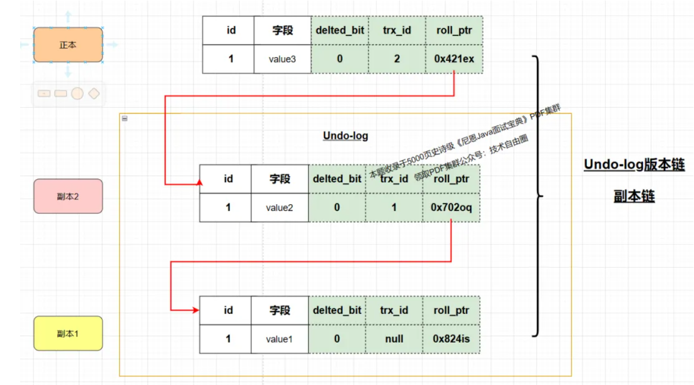
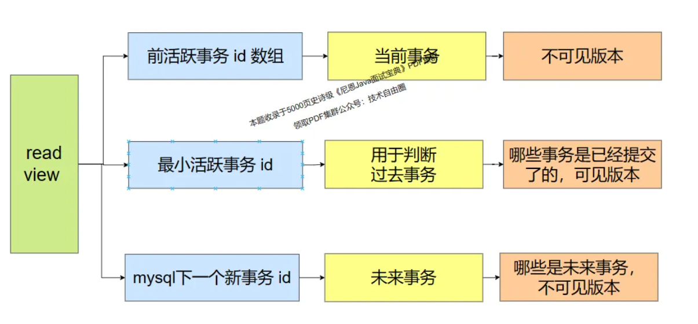

# MySQL相关

## 1.MySQL索引相关

### 1.1 SQL执行过程

根据逻辑架构图我们大致能将MySQL分为三层：

连接层：主要做连接处理、授权认证、安全保障等

server层：涵盖了MySQL大多数核心服务功能，包括查询解析、分析、优化、缓存以及所有内置函数（例如：日期，时间，数学和加密函数等）。存储过程，触发器，视图等跨存储引擎的功能也都在这一层实现。

存储引擎层：负责MySQL中的数据存储和提取。服务器通过API和存储引擎进行通信，API接口屏蔽了不同存储引擎之间的差异，使得这些差异对上层的查询过程透明。

SQL的执行过程：

- 客户端/服务端发送查询请求

- SQL服务端先查询查询缓存

  - 查询缓存是一个哈希表，key是SQL语句，value就是结果

  - 优点：查询速度快 缺点：需要更新缓存

  - 在MySQL的8.0版本直接将查询缓存整个功能都删掉了

- 服务端的SQL解析器对SQL语句进行解析，生成语法树
  - 我们在执行SQL时经常碰到的提示“You have an error in your SQL syntax”，就是分析器检查出来的错误。

- 查询优化器生成对用的执行计划
  - 例如选择使用哪个索引、决定各个表连接的顺序，它们最终执行的逻辑结果是一样，但是执行的效率会有不同。

- 执行查询计划，调用具体的执行引擎，结果返回

### 1.2 索引数据结构

索引是存储引擎用于快速找到记录的一种数据结构，MySQL常用B+树索引。

按「数据结构」分类：B+树索引、Hash索引、Full-text索引。

按「物理存储」分类：聚簇索引（主键索引）、非聚簇索引（二级索引）。

按「字段特性」分类：主键索引、唯一索引、普通索引、前缀索引。

按「字段个数」分类：单列索引、联合索引。

Hash索引： Hash索引基于哈希表实现，只有精确匹配索引所有列的查询才有效。对于每一行数据，引擎都会对键值进行哈希计算，哈希计算得出的哈希码是唯一的，然后在哈希表中进行查找，这种方式查找速度非常快。

- 只能用于等值比较，例如=、<=>、IN、AND等。

- 无法用于排序。

- 有冲突可能，

Full-text索引：使用全文索引，可以在查询字段是否包含指定值时不需要再使用like关键字，通过建立的倒排索引可以极大的提升检索效率。但对于该功能使用较少，目前一般都采用ES来实现。

B+索引：

它具有如下的特征：

非叶节点只存关键字以及索引下一层节点的指针

所有叶节点在同一层，包含全部关键字和指向记录的指针，并且按照关键字从小到大顺序链接

MySQL常用两种引擎InnDB和MyISAM对B+树的索引组织形式稍有不同。InnDB的主键索引叶节点上直接存储了行记录，行记录按物理顺序存储，也叫做聚簇索引，普通索引叶节点上存储的是主键索引值，称之为辅助索引。因此如果使用普通索引查询会走两遍索引：先通过辅助索引找到主键索引值，再到主键索引中检索获取记录行，这个过程叫回表。

在MyISAM中，普通索引和主键索引一样，叶节点存储的都是记录的物理地址，只会走一次索引。索引文件和数据文件是分开的。索引文件中存储了索引，数据文件中存储了实际的数据记录。对MyISAM表进行查询时，MySQL会首先在索引文件中查找，然后根据索引找到数据文件中的实际记录。

B+树性质

一个B+树索引可以索引多少行数据：以InnoDB为例，最小存储单元页大小为16k，假设索引主键为bigint型，长度为8字节，InnDB中的指针长度为6字节，这样一个索引项大小为14字节，一个16k大小的节点可以存下的索引项是16k/14=1170，即一个节点能够索引1170个子节点。由于InnDB主键索引叶节点存储了记录全部信息，如果一行记录大小为1k，一个叶节点的记录数就为16k/1k=16，对于一个高度为3的B+树，能够索引记录数是1170*1170*16=21902400条，所以只需要3次IO就能够索引千万级的数据了。

### 1.3 索引优化

#### 1.3.1 创建高效的索引

##### **a.主键索引规范**

建议使用int/bitint类型自增id作为主键，避免使用uuid等无序数据作为主键。无序主键可能会导致聚簇索引进行频繁页分裂。

##### **b.使用前缀索引**

如果对很长的字符列建立索引，会让索引变得大且慢。我们可以索引开始的部分字符，这样能大大节省索引空间，提高索引效率。例如，表T的字段name长度为50，可以只对其前5个字符建立索引，但是前缀索引也存在缺点，MySQL无法利用前缀索引做order by和group by 操作，也无法作为覆盖索引。

##### **c.选择合适的索引列**

区分度大的列优先

区分度： distinct(col) / count(col) 

宽度小的列优先

单节点的key值越多，索引树的高度越低，查询复杂度越低

字段更新不频繁

##### **e.避免创建冗余索引**

冗余索引是指在相同的列上按照相同的顺序创建的相同类型的索引，比如有一个索引(A,B)，再创建索引(A)就是冗余索引，因为索引(A)是索引(A,B)的前缀索引。

#### 1.3.2  正确使用索引

即使建立了索引，如果在查询中不注意的话，很容易造成索引失效，导致MySQL走全量扫描。

##### **a.最左前缀匹配原则**

对于联合索引，MySQL会一直向右匹配，直到遇到范围查询（< 、>、between、like等）就停止匹配。例如表T上有联合索引（a，b，c），只有a、ab、abc类型的查询会走这个索引，特别要注意对这种联合索引的使用

```mysql
-- 只有a走联合索引
select * from T where a>1 and b=2 and c=3
-- 不会走联合索引
select * from T where b=2 and c=3

-- b.禁止在索引字段上做数学运算或函数运算

select * from T where tagId + 1 = 50;
select * from T where month(updateTime) = 7;
```

上面两个查询分别对索引列使用了数学运算和函数运算，通过explain查看执行计划，可以发现他们都是走的全表扫描。因为对索引字段做数学运算和函数运算，可能会破坏索引值的有序性，所以优化器会放弃走索引。

##### b.隐式类型转换

比如下面这条SQL语句：

```mysql
select * from Tradelog where tradeid=123456
```

交易编号tradeid这个字段上有索引，但是explain的结果却显示这条语句会全表扫描。原因在于Tradeid的字符类型是varchar(32)，比较值却是整型，故需要做类型转换。在MySQL中字符串和数字进行比较的话是将字符串转换成数字，对于优化器来说，上面的查询语句相当于

```mysql
select * from Tradelog where cast(tradeid as signed int)=123456
```

也就是说，它对索引字段做了函数运算，所以会出现索引失效。

##### **c.使用like时避免前缀模糊查询'%xxx%'**

一般情况下不鼓励使用like，如果要使用的话避免以通配符%和_开头，即like '%xxx%'，它不会走索引，而like 'xxx%'能走索引。

##### **d.避免使用select ***

查询时尽量不要使用select *，而是只查出需要的字段，因为select * 无法利用覆盖索引优化，还会为服务器带来额外的IO、内存和cpu的消耗

##### **e.有or条件查询**

在WHERE子句中，如果在**OR前的条件列是索引列，而在OR后的条件列不是索引列，那么索引会失效**。

要保证**OR条件涉及的列都有索引**

```mysql
select * from Tradelog where bike_id = '8643600520' or has_del = 0;
```

### 1.4 联合索引

在美团外卖广告数据库查询语句里，使用频率最多的索引场景为联合索引，并且基本上每张表里都建立了联合索引，但是好多场景下使用的联合索引场景出现很多慢查询。其原因大部分都是联合索引没有命中，甚至出现滥用联合索引的情况。

#### 1.4.1 联合索引特点

##### **a.防止索引策略干扰**

MySQL查询语句里，where后面有多个单列索引，MySQL的explain执行计划会很可能干扰到你的索引执行策略，因为MySQL为了查询性能，很大概率会选中过滤效率最高的索引字段来进行查询，联合索引被MySQL的执行计划策略给干扰到的概率极小，因为联合索引本身它是多个列的组合，捆绑在一个数据域里，所以不会被MySQL执行计划受到干扰，也不会因为通过表里面的数据量过滤效率会被拆分取舍。

```mysql
select sex ,age from table where name like '张%' and age = 18，
```

这里name和age两个字段做为非聚簇索引。如下图，MySQL索引引擎不会一上来就依次遍历姓名B+ Tree和年龄B+ Tree，而是根据索引区分度，判断是否需要依次遍历两个索引字段B+ Tree，还是选中其中之一做为基础索引，只遍历该索引的B+ Tree，然后再根据该B+ Tree的叶子结点里的主键地址指针，再次遍历主键索引B+ Tree，一直遍历到叶子结点，找到对应的行数据，使用where条件过滤。

这种现象会对有些场景下，会产生严重影响。

```mysql
select sex ,age from table where name like '张%' and age = 18，
```

而联合索引本身就是一个B+ Tree结构，所以就不存在前面问题。

##### b.索引覆盖情况

聚簇索引B+树的结构里面，叶子结点存放的主键索引对应的行数据，非聚簇索引结构里面，叶子结点存放的是主键索引的值。通过非聚簇索引查询数据，需要通过叶子结点的主键索引值，去聚簇索引里面查询具体的行数据，这个过程称为回表

索引覆盖就是通过非聚簇索引已经可以获取全部需要的查询数据了，不需要再次回表

select  name,age from table where name like '张%' and age =18，如下图所示，索引字段为name和age字段，且同时select展示列也是该两个字段，所以name和age两个索引字段组成的B+树上，遍历到叶子节点之后，无需再通过回表方式遍历聚簇索引的B+树，因为通过联合索引的非聚簇索引B+树的叶子结点，已经拿到对应数据了。

##### c.放大索引下推的能力

索引下推就是把索引数据筛选的过程往下移动到存储引擎层面上完成，而不是在server层面上完成，可理解为在查询数据的时候就过滤了，不会在内存里面进行过滤。

理解MySQL的存储层和server层

从内存和磁盘的角度看，MySQL的Server层和存储引擎层各自负责不同的任务：

1. Server层主要处理内存中的操作，例如解析SQL语句、执行查询优化、管理缓存（例如查询缓存和表缓存）。当你执行一个SQL查询时，MySQL首先在Server层解析这个查询，然后生成一个查询计划。查询计划是执行查询的一种策略，它决定了如何使用索引、如何连接表等。然后，MySQL会尝试在内存中的缓存中查找查询结果，如果找到，就直接返回这个结果。

2. 存储引擎层主要处理磁盘上的数据存储和检索。当你执行一个查询时，如果在内存中的缓存中没有找到结果，MySQL就会在存储引擎层查找数据。存储引擎负责管理磁盘上的数据文件，执行数据的读取和写入操作。例如，如果你使用的是InnoDB存储引擎，那么InnoDB会在磁盘上的数据文件中查找数据，并将数据加载到内存中的缓冲池。

从查询过程和返回数据的过程看，Server层和存储引擎层也各自负责不同的任务：

1. Server层负责处理SQL查询的生命周期。当你执行一个SQL查询时，MySQL首先在Server层接收这个查询，然后解析查询、生成查询计划、执行查询，并最后返回查询结果。

2. 存储引擎层负责执行具体的数据操作。在查询计划中，如果需要访问表的数据，MySQL就会调用存储引擎的接口来读取或写入数据。存储引擎会根据查询计划的指示，从磁盘上的数据文件中查找数据，然后返回给Server层。

联合索引是多个索引字段组成，但是过滤并加载到内存的时候，会根据联合索引中多个索引列中的数值来筛选，即该操作在存储引擎上完成，不会全部加载到server端内存里，然后再从引擎端内存里筛选索引列中数值，这样就大大减少了磁盘到内存的IO次数。

select  name,age from table where name like '张%' and age =18

##### d.联合索引的最左前缀原则

简单的查询

特定的group by

试表结构如下：

```mysql
CREATE TABLE `status_test` (
  `id` bigint(20) NOT NULL AUTO_INCREMENT COMMENT 'ID',
  `sku_id` bigint(20) NOT NULL COMMENT 'sku_id',
  `wm_poi_id` bigint(20) NOT NULL COMMENT 'wmPoiId',
  `date_status` bigint(20) NOT NULL COMMENT '是否生效',
  `period` varchar(100) NOT NULL COMMENT '生效时间段',
  `nums` int(11) NOT NULL DEFAULT '1',
  `ctime` int(11) NOT NULL COMMENT '创建时间',
  `utime` int(11) NOT NULL COMMENT '修改时间',
  PRIMARY KEY (`id`),
  UNIQUE KEY `uniq_sku` (`sku_id`),
  KEY `idx_poi` (`wm_poi_id`),
  KEY `idx_date_status` (`date_status`)
) ENGINE=InnoDB AUTO_INCREMENT=1 DEFAULT CHARSET=utf8mb4 COLLATE=utf8mb4_unicode_ci COMMENT='SKU生效日期';
```


我们建立`date_status`+`wm_poi_id`+`nums`的联合索引，按照“最左匹配”原则相当于我们对 （`date_status`）、（`date_status`,`wm_poi_id`）和（`date_status`,`wm_poi_id`,`nums`）创建了索引，但是并未对（`wm_poi_id`）和（`wm_poi_id`,`nums`）建立索引。

1.SELECT * FROM status_test WHERE wm_poi_id = 607002 LIMIT 100
2.SELECT * FROM status_test WHERE date_status > 0 AND wm_poi_id = 607002 LIMIT 100
3.SELECT * FROM status_test WHERE date_status = 1 AND wm_poi_id = 607002 LIMIT 100

上述三个查询语句中，查询语句1命中单值索引，查询语句2是无法命中wm_poi_id的索引的，其中示例2能够命中`date_status`,`wm_poi_id`,`nums`组合索引的`date_status`索引，但是后续对wm_poi_id进行检索时，则为全表扫描，下面从B+树索引角度分析如下：

当date_status是个范围的时候，wm_poi_id是无序的，当date_status为某一个确定的值的时候，wm_poi_id是有序的，通过date_status范围过滤之后，在命中范围内数据，wm_poi_id并非有序(图中红色字段)，因此无法通过索引直接过滤，需要将范围内数据全部遍历扫描

对于语句3索引查询过程如上图3-2所示，通过date_status = 1的数据进行过滤查询，在结果集中wm_poi_id局部有序(图中红色字段)，因此可以通过`wm_poi_id`索引直接过滤和查询，也即命中联合索引。最左前缀匹配原则的核心为通过左侧前缀过滤查询到的数据，对右侧的查询来说是局部有序的、能够通过索引结构检索的。

**条件过滤为常量过滤，并且order by字段能够配合常量过滤满足最左前缀，也可以通过联合索引优化排序性能；**

CREATE TABLE `wm_ad_poi_date_status_copy` (
  `id` bigint(20) NOT NULL AUTO_INCREMENT COMMENT 'ID',
  `sku_id` bigint(20) NOT NULL COMMENT 'wm poi id',
  `wm_poi_id` bigint(20) NOT NULL COMMENT 'wmPoiId',
  `date_status` bigint(20) NOT NULL COMMENT '是否生效',
  `period` varchar(100) COLLATE utf8mb4_unicode_ci NOT NULL COMMENT '生效时间段',
  `nums` bigint(20) NOT NULL DEFAULT '123456' COMMENT '注释',
  `ctime` int(11) NOT NULL COMMENT '创建时间',
  `utime` int(11) NOT NULL COMMENT '修改时间',
  PRIMARY KEY (`id`),
  KEY `idx_poi_nums_status` (`wm_poi_id`,`nums`,`date_status`)
) ENGINE=InnoDB AUTO_INCREMENT=428091624 DEFAULT CHARSET=utf8mb4 COLLATE=utf8mb4_unicode_ci COMMENT='SKU生效日期';

如果表结构，建立了 (`wm_poi_id`,`nums`,`date_status`)的联合索引，则下述语句a)、b)可以通过联合索引来检索和排序；

a) select * from wm_ad_poi_date_status_copy where wm_poi_id = 607002 order by nums;
b) select * from wm_ad_poi_date_status_copy where wm_poi_id = 607002 order by nums,date_status; 

对于wm_poi_id = 607002 nums是有序的

对于wm_poi_id = 607002 nums、date_status 是有序的

如果过滤条件不是常量，但是order by中列能够满足联合索引的最左前缀，也是可以通过该联合索引来提升排序性能的，示例如下：

c) select * from wm_ad_poi_date_status_copy where wm_poi_id > 606999 order by wm_poi_id,nums;

而对于语句d)和语句e)，建立（`wm_poi_id`,`nums`,`date_status`）联合索引，相当于建立了(`wm_poi_id`,`nums)索引

d) select /*!40001 SQL_NO_CACHE */ * from wm_ad_poi_date_status_copy where wm_poi_id = 607002 
																		 and date_status > 34043232555 order by nums desc limit 100;

e) select /*!40001 SQL_NO_CACHE */ * from wm_ad_poi_date_status_copy where wm_poi_id = 607002 
																		  and nums > 331133 order by date_status desc limit 100;

对于语句d，wm_poi_id为常量，(`nums`,`date_status`) 组合为有序的，再对`date_status`进行过滤，此时无法走到索引；最后在查询到的子集上进行排序，此时由于排序字段是`nums`，（`wm_poi_id`,`nums`,`date_status`）索引，在`wm_poi_id`相同的情况下，`nums`有序，也即可以走`nums`索引，所以没有额外的排序

对于语句e，wm_poi_id为常量，(`nums`,`date_status`) 组合为有序的，过滤查询时走`wm_poi_id`和`nums`索引过滤不符合条件的记录由于nums是范围查询，此时过滤结果子集中`date_status`不是完全有序的，此时order by操作需要单独进行排序，

##### e.聚合操作场景

我们在对group by语句进行查询优化，一般会试图通过松散索引扫描（loose index scan）和紧凑索引扫描（tight index scan）来提高语句执行效率。在不满足松散索引扫描和紧凑索引扫描的情况下，group by语句需要先扫描整个表，提取数据创建一个临时表，再根据group by语句中指定的列进行排序，排序之后就可以找到所有的分组，然后执行聚集函数（例如max、min等），这个过程在执行计划中的表现为会出现类似“Using temporary; Using filesort”的关键字；通过松散索引扫描和紧凑索引扫描来提高语句执行效率，主要的思路是希望在读取索引的基础上直接完成group by操作，以跳过创建临时表和排序操作，由于很多情况下，我们的聚合操作的分组依据的列都有多个，要想使用松散索引或者紧凑索引，需要他们来自同一个索引，也就必须配合联合索引。

松散索引扫描（Loose Index Scan）

在这种方式下，MySQL会扫描索引的一部分，找到满足查询条件的第一个记录，然后通过索引指针读取表中的数据。然后，MySQL会继续扫描索引，找到下一个满足查询条件的记录，再读取表中的数据。这个过程会重复进行，直到扫描完所有满足查询条件的记录。这种方式下，索引扫描和表数据的读取是交替进行的。

紧凑索引扫描（Tight Index Scan）

在这种方式下，MySQL会一次性扫描完索引的所有满足查询条件的记录，然后再一次性读取表中的所有数据。这种方式下，索引扫描和表数据的读取是分开进行的。

假设有一个包含销售数据的表sales，并在product_id和sale_date列上创建了索引：

CREATE TABLE sales (
    id INT PRIMARY KEY,
    product_id INT,
    sale_amount DECIMAL(10, 2),
    sale_date DATE,
    INDEX idx_product_date (product_id, sale_date)

);

查询1:查询每个产品的最早销售日期：
SELECT product_id, MIN(sale_date) FROM sales GROUP BY product_id;

查询2:查询每个产品的总销售额：
SELECT product_id, SUM(sale_amount) FROM sales GROUP BY product_id;

在查询1中，MySQL可以使用松散索引扫描，直接跳到每个product_id的第一条记录（即最早的sale_date），而不需要扫描所有记录。

在查询2中，product_id列与索引idx_product_date的前缀列完全匹配，MySQL可以使用紧凑索引扫描，通过扫描索引来找到每个product_id的所有记录，并计算总销售额。

下面看一个例子：

操作数据表结构如下：

CREATE TABLE `status_test` (
  `id` bigint(20) NOT NULL AUTO_INCREMENT COMMENT 'ID',
  `sku_id` bigint(20) NOT NULL COMMENT 'wm poi id',
  `wm_poi_id` bigint(20) NOT NULL COMMENT 'wmPoiId',
  `date_status` bigint(20) NOT NULL COMMENT '是否生效',
  `period` varchar(100) COLLATE utf8mb4_unicode_ci NOT NULL COMMENT '生效时间段',
  `nums` int(11) NOT NULL DEFAULT '1',
  `ctime` int(11) NOT NULL COMMENT '创建时间',
  `utime` int(11) NOT NULL COMMENT '修改时间',
  PRIMARY KEY (`id`),
  UNIQUE KEY `uniq_sku` (`sku_id`),
  KEY `idx_poi` (`wm_poi_id`),
  KEY `idx_date_status` (`date_status`)
) ENGINE=InnoDB AUTO_INCREMENT=1 DEFAULT CHARSET=utf8mb4 COLLATE=utf8mb4_unicode_ci COMMENT='SKU生效日期';

查询语句：

SELECT  /*!40001 SQL_NO_CACHE */ wm_poi_id,date_status,max(nums)
FROM status_test 
GROUP BY date_status,wm_poi_id
LIMIT 300

由于group by中字段不在同一个索引中，无法使用松散索引或者紧凑索引，创建`date_status`,`wm_poi_id`,`nums`联合索引，再次执行。

首先，我们大致的构造出表中`date_status`+`wm_poi_id`+`nums`联合索引的B+树结构，如图所示：

案例中语句命中`idx_poi_status_num`，由于联合索引特性，其索引列有序，因此在按照wm_poi_id和date_status分组后，能直接通过索引计算出max(num)，不需要取的叶子节点的主键索引更不需要回表操作。因此查询效率远高于没有未使用到紧凑索引和松散索引的情况。

聚合查询走松散索引很重要的一个条件是group by的所有列是表中一个索引或者这个索引的最左前缀，并且不包含这个索引之外的其它列，一旦group by的字段超过一个，就必然要求表中有符合条件的联合索引，否则都无法走松散索引扫描

##### f.数据极端分布下联合索引的作用

一般情况下，如果DB中某一个字段的枚举值数量很小，则一般不建立索引，例如性别，但是如果数据分布比较极端，在一定的业务查询场景下，创建联合索引可以极大的提高查询效率。如下慢查询语句：

表p_id_test初始结构为：

CREATE TABLE `p_id_test` (
  `id` int(11) NOT NULL AUTO_INCREMENT COMMENT '主键',
  `p_id` bigint(20) NOT NULL COMMENT 'id',
  `name` varchar(30) NOT NULL COMMENT '名称',
  `w_s_id` bigint(20) NOT NULL COMMENT 's_id',
  `status` int(11) NOT NULL DEFAULT '1' COMMENT '状态',
  `ctime` int(11) NOT NULL COMMENT '创建时间',
  `utime` int(11) NOT NULL COMMENT '更新时间',
  PRIMARY KEY (`id`),
  KEY `idx_p_id` (`p_id`),
  KEY `idx_w_s_id` (`w_s_id`)
) ENGINE=InnoDB AUTO_INCREMENT=1 DEFAULT CHARSET=utf8 COMMENT='测试数据表';

SELECT * FROM p_id_test WHERE p_id = 10 AND status = 0 ;

SELECT /*!40001 SQL_NO_CACHE */  * FROM p_id_test WHERE p_id = 44241135 AND status = 0 ;

其中p_id_test表中大概100W+数据，由于业务原因，表中status字段分布如下表，字段值为1占比超过90%

status字段值枚举

数据统计

1

972089

0

30889

2

1

`status`字段只有三个值，区分度很低，但是添加`p_id`+`status`索引之后为什么查询效率会明显提高？结合status数据分布，观察`p_id`+`status`联合索引B+树结构，可以很直观的看到，当查询条件查询的`status`不为1时，每次查询通过`p_id`+`status`索引可以将`p_id`命中的数据过滤掉很大的一部分，命中的数据量很小，结合业务中查询中多为查询`status`为0的情况，增加联合索引可以轻易的解决业务中的慢查询。

## 2.MySQL慢查询

### 2.1 整体的优化流程

1.查看线上的RDS数据库监控平台，显示近两周的慢查询SQL语句：查询时间大于0.5s || 调用量较大的

2.查看当前查询语句对应的数据库表的结构+当前SQL语句的执行计划

根据执行计划，优化SQL语句，优化思路：

- 查看已有的索引，是否满足当前的查询需求

- 对于查询字段较少的语句，

  - 索引覆盖（解释一下索引覆盖）
  - 扩展信息里面是 using index 不需要回表

- 根据查询条件，建立联合索引 

  - 放大索引下推
    - 扩展信息是：using index condition
    - 解释一下MySQL的server层和存储引擎层
    - 索引下推就是把索引数据筛选的过程往下移动到存储引擎层面上完成
  - 优化排序性能-减少额外的文件排序
    - 对于等值和非等值情况
    - 本质上是利用联合索引最左前缀的有序性减少文件排序
    - 对于联合索引满足按照最左匹配有序
    - 具体见下面的例子

  - 聚合操作场景

    - 松散索引扫描（loose index scan）和紧凑索引扫描（tight index scan）

    - **松散索引扫描（Loose Index Scan）**：通过跳过同一分组中的冗余记录，只扫描每个分组的第一个记录，减少扫描量，从而提高执行效率。适用于需要分组而无需扫描整个分组内容的场景。

      **紧凑索引扫描（Tight Index Scan）**：通过完整扫描索引，利用索引的排序特性，在扫描的同时完成排序或分组，避免额外的排序步骤。适用于索引顺序与 `GROUP BY` 或 `ORDER BY` 顺序一致的场景。

  - 数据极端分布

    - 如果DB中某一个字段的枚举值数量很小，则一般不建立索引，例如性别，但是如果数据分布比较极端，在一定的业务查询场景下，创建联合索引可以极大的提高查询效率

- 对于一些limit字段优化，设置为大于

- 对于 or 条件要保证前后都是索引

- 查找到一些索引失效的原因

  - in的内容太多，导致直接走主键索引
  - 个别字段由于 区分度太低，导致索引无效

``` mysql
select
  id
from
  mbk_findbike_book_fence_record
where
  user_id = 85522
  and status = 0
  and deleted = 0;
```

联合索引优化举例：

```mysql

/*等值的情况*/
# 索引是（A,B,C）
select * where  A = 'a' order by B  -- 优化到
select * where  A = 'a' AND B = 'b' order by C  -- 优化到
/*不等值的情况*/
# 索引是（A,B,C）
select * where  A > 'a' order by B,C -- 不需要额外的排序
select * where  A = 'a' AND C > 'c' order by B  -- 当A固定的时候，B是有序的，此时根据C条件过滤，过滤完成，根据B排序，B是有序的，											   所以这个语句是不需要进行额外排序的
select * where  A = 'a' AND B > 'b' order by C  -- 当A固定的时候，B是有序的，范围查询的时候，速度就很快，但是 B 很多的时候，C就											   是无序，因此按照C进行排序的时候，需要一个额外的排序，using filesort
# 索引是（A,B,C）
select Max(C) group by A , B  -- 根据A和B分组，这样C就是有序的，可以直接通过索引计算出最大的值

SELECT * FROM p_id_test WHERE p_id = 10 AND status = 0 ;

/*等值的情况*/
SELECT  * FROM p_id_test WHERE p_id = 44241135 AND status = 0 ; -- 其中p_id_test表中大概100W+数据，由于业务原因，表中status字段分布如下表，字段值为1占比超过90%

/*
status字段值枚举
数据统计
1-972089
0-30889
2-1
*/

/*id:3da50980*/
/*ip=10.201.228.248*/
/*+zebra:w*/
select
  id,
  bike_id,
  user_id,
  problem_name,
  problem_group,
  problem_priority,
  operate_Time
from
  mbk_pre_interfere_record
where
  bike_id = '8641939024'
  and user_id = 69317
  and operate_Time > '2024-07-21 10:05:18.714'
order by
  operate_Time desc
limit
  1;
```


### 2.2 关于执行计划

type列：表的访问和连接方式。按照性能从好到坏依次为：

- system：表中只有一行数据，相当于系统表
- const：最多返回一条记录，通常表示使用主键或者唯一索引查找单个值；
- eq_ref：唯一性索引扫描，对于每个索引键，表示只有一条记录与之匹配，常见于主键或唯一索引扫描，对于前面的每行数据，从该表中读取一行。
- ref：非唯一性索引扫描，返回匹配某个单独值的所有行。
- range：索引，范围 < >
- index：扫描全索引
- ALL：扫描全表

key：实际走的索引

possible_key：可能用到的索引

rows：预估要扫描的行

Extra：

- using index 直接通过索引返回数据，不需要访问表中的数据，索引覆盖。

- using where 存储引擎过滤，使用 WHERE 子句限定传递给下一个表或者发送给客户端的数据行

- using filesort 表示需要执行一次额外的遍历，从而按照排序顺序返回数据行

- using temporary 表示需要创建一个临时表来处理结果，通常在order by group by

- Using index condition 在MySQL中就是所谓的"索引下推"（Index Condition Pushdown，ICP）。


2.com.sankuai.bikeb.fulfill.core 

2.1 mbk_search_bike_record 表

```mysql
CREATE TABLE `mbk_search_bike_record` (
  `id` bigint(20) unsigned NOT NULL AUTO_INCREMENT COMMENT '主键自增',
  `bike_id` varchar(11) NOT NULL COMMENT '车辆ID',
  `user_id` int(11) NOT NULL COMMENT '用户ID',
  `order_id` varchar(45) NOT NULL COMMENT '工单id',
  `sub_order_id` varchar(16) NOT NULL DEFAULT '0' COMMENT '工单-子单id',
  `delivery_id` bigint(20) NOT NULL DEFAULT '0' COMMENT '已送达批次ID',
  `delivered_confirm_way` tinyint(4) NOT NULL DEFAULT '0' COMMENT '干预送达确认方式(1自动,2手动,3蓝牙)',
  `operation_type` int(11) NOT NULL COMMENT '车辆分拣类型,用于区分好车和坏车',
  `action` int(11) DEFAULT NULL COMMENT '原子动作',
  `tag_name` varchar(100) DEFAULT NULL COMMENT '车辆标签,好车和坏车标签',
  `tag_group` varchar(50) DEFAULT NULL COMMENT '标签组',
  `priority` tinyint(4) DEFAULT NULL COMMENT '找车优先级',
  `is_force_interfere` bit(1) DEFAULT NULL COMMENT '是否为强制干预的健康车辆:1是,0不是',
  `city_code` varchar(8) DEFAULT NULL COMMENT '城市code',
  `is_random_code` bit(1) DEFAULT b'0' COMMENT '是否为三无车:1是,0不是',
  `has_del` tinyint(4) NOT NULL DEFAULT '0' COMMENT '是否删除:0正常,1删除',
  `create_time` datetime NOT NULL DEFAULT CURRENT_TIMESTAMP COMMENT '创建时间',
  `update_time` datetime NOT NULL DEFAULT CURRENT_TIMESTAMP ON UPDATE CURRENT_TIMESTAMP COMMENT '更新时间',
  PRIMARY KEY (`id`),
  KEY `idx_bike_id` (`bike_id`),
  KEY `idx_user_id` (`user_id`),
  KEY `idx_order_id` (`order_id`),
  KEY `idx_delivery_id` (`delivery_id`),
  KEY `idx_create_time` (`create_time`),
  KEY `idx_sub_order_id` (`sub_order_id`)
) ENGINE=InnoDB AUTO_INCREMENT=514350663 DEFAULT CHARSET=utf8mb4 COMMENT='找车业务表'
```


语句1-建立联合索引

平均耗时0.561450 调用量7477

```mysql
/*id:1f1acd67*/
/*ip=10.7.250.227*/
/*+zebra:w*/
select
  id,
  bike_id,
  user_id,
  order_id,
  sub_order_id,
  operation_type,
  action,
  tag_name,
  tag_group,
  priority,
  is_force_interfere,
  city_code,
  is_random_code,
  delivery_id,
  delivered_confirm_way,
  create_time,
  update_time
from
  mbk_search_bike_record
where
  bike_id = '8643600520'
  and create_time between '2024-06-13 15:48:13.377' AND '2024-07-13 15:48:13.377'
  and has_del = 0;
```


core中代码

```java
/**

  * 查询某辆车一段时间内的找寻记录
    */
    @Select({
      "/*+zebra:w*/select ", QUERY_FIELDS, " from ", TABLE_NAME,
      " where bike_id = #{bikeId} and create_time between #{fromTime} AND #{toTime} and has_del = 0"
      })
    List<SearchBikeRecord> getRecordsByBikeIdInATimeRange(@Param("bikeId") String bikeId, @Param("fromTime") Date from,
                                                   @Param("toTime") Date to);
```

执行计划

查询仅用到普通索引bike_id

bike_id上有一个等值条件，直接定位到具有特定bike_id的行，数据和where条件进行对比

优化建议

联合索引：创建一个包含 bike_id ,create_time,has_del 的联合索引。该复合索引可以让查询更高效地利用索引来过滤数据。

创建 （bike_id ,has_del ）联合索引

语句2

平均耗时：0.323367  调用量：1221

```mysql
/*id:22e0f62f*/
/*ip=10.201.141.205*/
	
insert into
  mbk_search_bike_record (
    bike_id,
    user_id,
    order_id,
    sub_order_id,
    operation_type,
    action,
    tag_name,
    tag_group,
    priority,
    is_force_interfere,
    city_code,
    is_random_code
  )
values
  (
    '8645065290',
    282065,
    '416246782',
    '2393085590',
    6,
    2,
    'healthy',
    'scatter_motor',
    null,
    0,
    '0755',
    0
  );
```


Java代码

```mysql
@Insert({
  "insert into ", TABLE_NAME,
  " (", INSERT_FIELDS, ")",
  " values ",
  " (#{record.bikeId}, #{record.userId}, #{record.orderId}, #{record.subOrderId},"
    + " #{record.operationType}, #{record.action}, #{record.tagName}, #{record.tagGroup}, #{record.priority}, #{record.forceInterfere}, #{record.cityCode}, #{record.randomCode})"
  })
@Options(useGeneratedKeys = true, keyProperty = "record.id", keyColumn = "id")
int insert(@Param("record") SearchBikeRecord record);
```


2.2 mbk_pre_interfere_record表

```mysql
CREATE TABLE `mbk_pre_interfere_record` (
  `id` bigint(20) unsigned NOT NULL AUTO_INCREMENT COMMENT '预干预id',
  `bike_id` varchar(11) NOT NULL DEFAULT '' COMMENT '车辆ID',
  `user_id` int(11) NOT NULL DEFAULT '0' COMMENT '用户ID',
  `problem_name` varchar(100) DEFAULT NULL COMMENT 'BPTS故障名称',
  `problem_group` varchar(50) DEFAULT NULL COMMENT 'BPTS故障组',
  `problem_priority` tinyint(4) NOT NULL DEFAULT '0' COMMENT 'BPTS故障优先级(0普通,1和2都是优先, 1是算法计算出来的,2是城市导入的)',
  `operate_time` datetime NOT NULL DEFAULT '1970-01-01 08:00:00' COMMENT '预干预操作时间',
  `create_time` datetime NOT NULL DEFAULT CURRENT_TIMESTAMP COMMENT '创建时间',
  `update_time` datetime NOT NULL DEFAULT CURRENT_TIMESTAMP ON UPDATE CURRENT_TIMESTAMP COMMENT '更新时间',
  PRIMARY KEY (`id`),
  KEY `idx_bike_id` (`bike_id`),
  KEY `idx_user_id` (`user_id`),
  KEY `idx_operate_time` (`operate_time`)
) ENGINE=InnoDB AUTO_INCREMENT=6740677 DEFAULT CHARSET=utf8mb4 COMMENT='预干预记录表'
```


语句1-建立联合索引

查询时间0.507984  调用量51

/*id:3da50980*/
/*ip=10.201.228.248*/
/*+zebra:w*/
select
  id,
  bike_id,
  user_id,
  problem_name,
  problem_group,
  problem_priority,
  operate_Time
from
  mbk_pre_interfere_record
where
  bike_id = '8641939024'
  and user_id = 69317
  and operate_Time > '2024-07-21 10:05:18.714'
order by
  operate_Time desc
limit
  1;

core中代码


/**
     * 根据bikeid和userId查询一条在一定时间内的有效记录
     *
     * @param bikeId 自行车id
     * @param userId 用户id
     * @param availableTime 有效时间(在此之后的时间)
     *
     * @return
     */
@Select({
  "/*+zebra:w*/",
  " select ", QUERY_FIELDS,
  " from ", TABLE_NAME,
  " where bike_id = #{bikeId} and user_id = #{userId} and operate_Time > #{availableTime} ",
  " order by operate_Time desc limit 1"
  })
BikeFaultSnapshotDO queryUserValidBikeFaultSnapshot(@Param("bikeId") String bikeId, @Param("userId") int userId,
                                                    @Param("availableTime") Date availableTime);

执行计划


使用文件排序，无法直接通过索引的顺序来返回查询结果

优化建议

去掉原有的`bike_id`索引，创建`bike_id`,`user_id`,`operate_time`联合索引，

3.com.sankuai.bikeb.roadwork.tools

3.1 mbk_bike_frozen_record表

平均耗时：1.443367  慢查数2354

SELECT
  *
FROM
  mbk_bike_frozen_record
WHERE
  id IN (
    SELECT
      max(id)
    FROM
      mbk_bike_frozen_record
    WHERE
      bike_id IN (?)
      AND deleted = ?
    GROUP BY
      bike_id
  );

4.com.sankuai.mola.findbike.server

4.1 mbk_operator_touch_bike_record表

CREATE TABLE `mbk_operator_touch_bike_record` (
  `id` bigint(20) unsigned NOT NULL AUTO_INCREMENT COMMENT '自增主键',
  `bike_id` varchar(15) COLLATE utf8_bin NOT NULL COMMENT '车辆编码',
  `city_code` varchar(10) COLLATE utf8_bin DEFAULT NULL COMMENT '城市编码',
  `user_id` int(10) DEFAULT NULL COMMENT '用户ID',
  `touch_action` varchar(50) COLLATE utf8_bin NOT NULL COMMENT '触达/解除动作',
  `operator_touched` tinyint(3) NOT NULL COMMENT '触达/解除类型, 0-未触达, 1-触达',
  `touch_session_id` bigint(20) DEFAULT NULL COMMENT '触达会话ID',
  `touch_time` datetime DEFAULT NULL COMMENT '触达时间',
  `free_time` datetime DEFAULT NULL COMMENT '解除触达时间',
  `remark` varchar(1000) COLLATE utf8_bin DEFAULT NULL COMMENT '备注信息',
  `create_time` datetime NOT NULL DEFAULT CURRENT_TIMESTAMP COMMENT '创建时间',
  PRIMARY KEY (`id`),
  KEY `idx_bike_id` (`bike_id`),
  KEY `idx_type` (`touch_action`)
) ENGINE=InnoDB AUTO_INCREMENT=526357585 DEFAULT CHARSET=utf8 COLLATE=utf8_bin COMMENT='单车运营触达记录'

语句1

平均耗时0.522817  慢查数1483

/*id:c071ce52*/
/*ip=10.201.228.248*/
/*+zebra:w*/
select
  id,
  bike_id,
  city_code,
  user_id,
  touch_action,
  operator_touched,
  touch_session_id,
  touch_time,
  free_time,
  remark
from
  mbk_operator_touch_bike_record
where
  bike_id = '8650343733'
order by
  id desc
limit
  1;

查看执行计划

优化建议

4.2 mbk_bike_life表

CREATE TABLE `mbk_bike_life` (
  `BIKEID` varchar(15) NOT NULL COMMENT '自行车ID',
  `STATUS` char(3) NOT NULL COMMENT '当前状态：0 工厂模式（工厂注册）\n10 出厂模式（出厂质检）\n20 投放模式（运营投放)\n30 运营模式（投入运营)\n40 被盗模式(确认被盗)\n50 维修模式(维修时间)\n60 返厂模式(返厂时间)70 注销',
  `TS` timestamp NOT NULL DEFAULT CURRENT_TIMESTAMP ON UPDATE CURRENT_TIMESTAMP COMMENT '状态变更时间',
  `chargeManName` varchar(30) DEFAULT NULL,
  `citycode` varchar(10) DEFAULT NULL,
  `adcode` varchar(10) DEFAULT NULL,
  `activeStatusEnum` varchar(20) DEFAULT NULL COMMENT '自行车状态:ACTIVE，NOT_ACTIVE, WAIT_REGISTER, WAIT_REGISTER_CHECK',
  `id` bigint(20) unsigned NOT NULL AUTO_INCREMENT,
  PRIMARY KEY (`id`),
  UNIQUE KEY `BIKEID_INDEX` (`BIKEID`) USING BTREE,
  KEY `STATUS_INDEX` (`STATUS`)
) ENGINE=InnoDB AUTO_INCREMENT=21118917 DEFAULT CHARSET=utf8

语句1-索引覆盖

平均耗时1.179241 慢查数312

/*id:bbc1a7fa*/
/*ip=10.122.149.56*/
/*+zebra:w*/
select
  BIKEID
from
  mbk_bike_life
where
  status in ('51', '120', '128')
  and TS > '2024-07-29 08:49:00';

查看执行计划

优化建议

创建（status，TS，BIKEID）联合索引，走索引覆盖

4.3 mbk_search_bike_record 表

CREATE TABLE `mbk_search_bike_record` (
  `id` bigint(20) unsigned NOT NULL AUTO_INCREMENT COMMENT '主键自增',
  `bike_id` varchar(11) NOT NULL COMMENT '车辆ID',
  `user_id` int(11) NOT NULL COMMENT '用户ID',
  `order_id` varchar(45) NOT NULL COMMENT '工单id',
  `sub_order_id` varchar(16) NOT NULL DEFAULT '0' COMMENT '工单-子单id',
  `delivery_id` bigint(20) NOT NULL DEFAULT '0' COMMENT '已送达批次ID',
  `delivered_confirm_way` tinyint(4) NOT NULL DEFAULT '0' COMMENT '干预送达确认方式(1自动,2手动,3蓝牙)',
  `operation_type` int(11) NOT NULL COMMENT '车辆分拣类型,用于区分好车和坏车',
  `action` int(11) DEFAULT NULL COMMENT '原子动作',
  `tag_name` varchar(100) DEFAULT NULL COMMENT '车辆标签,好车和坏车标签',
  `tag_group` varchar(50) DEFAULT NULL COMMENT '标签组',
  `priority` tinyint(4) DEFAULT NULL COMMENT '找车优先级',
  `is_force_interfere` bit(1) DEFAULT NULL COMMENT '是否为强制干预的健康车辆:1是,0不是',
  `city_code` varchar(8) DEFAULT NULL COMMENT '城市code',
  `is_random_code` bit(1) DEFAULT b'0' COMMENT '是否为三无车:1是,0不是',
  `has_del` tinyint(4) NOT NULL DEFAULT '0' COMMENT '是否删除:0正常,1删除',
  `create_time` datetime NOT NULL DEFAULT CURRENT_TIMESTAMP COMMENT '创建时间',
  `update_time` datetime NOT NULL DEFAULT CURRENT_TIMESTAMP ON UPDATE CURRENT_TIMESTAMP COMMENT '更新时间',
  PRIMARY KEY (`id`),
  KEY `idx_bike_id` (`bike_id`),
  KEY `idx_user_id` (`user_id`),
  KEY `idx_order_id` (`order_id`),
  KEY `idx_delivery_id` (`delivery_id`),
  KEY `idx_create_time` (`create_time`),
  KEY `idx_sub_order_id` (`sub_order_id`)
) ENGINE=InnoDB AUTO_INCREMENT=516406978 DEFAULT CHARSET=utf8mb4 COMMENT='找车业务表'

语句1-建立联合索引

平均耗时0.541130  查询总数197

/*id:1f1acd67*/
/*ip=10.201.141.205*/
/*+zebra:w*/
select
  id,
  bike_id,
  user_id,
  order_id,
  sub_order_id,
  operation_type,
  action,
  tag_name,
  tag_group,
  priority,
  is_force_interfere,
  city_code,
  is_random_code,
  delivery_id,
  delivered_confirm_way,
  create_time,
  update_time
from
  mbk_search_bike_record
where
  bike_id = '8644194763'
  and create_time between '2024-06-29 10:36:13.423' AND '2024-07-29 10:36:13.423'
  and has_del = 0;

执行计划

优化建议：

创建(bike_id，create_time，has_del)联合索引

4.4 mbk_findbike_bike_mark_record表

CREATE TABLE `mbk_findbike_bike_mark_record` (
  `id` bigint(20) NOT NULL AUTO_INCREMENT COMMENT '主键自增',
  `region_id` varchar(20) NOT NULL COMMENT 'regionid',
  `bike_id` varchar(25) NOT NULL COMMENT 'bikeid',
  `business_line` varchar(8) NOT NULL DEFAULT 'BIKE' COMMENT '业务线，单车：BIKE,电单车：SPOCK',
  `mark_situation_code_list` varchar(500) DEFAULT '[]' COMMENT '标记对象现象编码列表',
  `mark_remark` varchar(255) NOT NULL COMMENT '标记描述',
  `mark_type` varchar(20) NOT NULL COMMENT '标记类型',
  `mark_user_id` int(11) DEFAULT '0' COMMENT '标记人',
  `mark_time` datetime DEFAULT NULL COMMENT '标记时间',
  `bike_status` int(11) DEFAULT '0' COMMENT '车辆状态',
  `touched` tinyint(4) NOT NULL DEFAULT '0' COMMENT '是否已触达:0未触达,1已触达',
  `touch_user_id` int(11) DEFAULT '0' COMMENT '触达人',
  `photos` varchar(1000) NOT NULL DEFAULT '[]' COMMENT '照片',
  `report_type` tinyint(4) NOT NULL DEFAULT '0' COMMENT '上报类型:0 未知,1 一般权限故障上报,2 故障标记,3 干预回库',
  `deleted` tinyint(4) NOT NULL DEFAULT '0' COMMENT '是否删除:0正常,1删除',
  `create_time` datetime NOT NULL DEFAULT CURRENT_TIMESTAMP COMMENT '创建时间',
  `create_user` varchar(20) NOT NULL DEFAULT '' COMMENT '创建人',
  `update_time` datetime NOT NULL DEFAULT CURRENT_TIMESTAMP ON UPDATE CURRENT_TIMESTAMP COMMENT '更新时间',
  `update_user` varchar(20) NOT NULL DEFAULT '' COMMENT '更新人',
  PRIMARY KEY (`id`),
  KEY `idx_bike_id` (`bike_id`),
  KEY `idx_mark_user_id` (`mark_user_id`),
  KEY `idx_region_id_mark_time` (`region_id`,`mark_time`),
  KEY `idx_deleted_create_time_region_id` (`deleted`,`create_time`,`region_id`)
) ENGINE=InnoDB AUTO_INCREMENT=697452 DEFAULT CHARSET=utf8mb4 COMMENT='标记记录表'

语句1-优化查询条件

平均耗时 0.588343 查询总量：15

/*id:ff881e53*/
/*ip=10.44.63.126*/
SELECT
  ID,
  CREATE_TIME,
  region_id,
  bike_id,
  mark_situation_code_list,
  mark_remark,
  mark_type,
  mark_user_id,
  mark_time,
  bike_status,
  touched,
  touch_user_id,
  photos,
  deleted,
  create_user,
  update_user
FROM
  mbk_findbike_bike_mark_record
WHERE
  deleted = 0
  AND create_time >= '2024-07-21 00:00:00'
  AND create_time < '2024-07-27 23:00:00'
  AND region_id = '028'
order by
  id desc
limit
  0, 200;

查看执行计划

有 `idx_deleted_create_time_region_id` (`deleted`,`create_time`,`region_id`)但是没有走，数据总数为699466 deleted = 0 为699466，全表都是delet为0的数据，最后还需要根据id排序，直接走主键索引了

优化建议：

优化SQL查询语句

创建(`region_id`,`create_time`)联合索引

4.5 mbk_findbike_book_fence_record表

CREATE TABLE `mbk_findbike_book_fence_record` (
  `id` bigint(20) NOT NULL AUTO_INCREMENT COMMENT '主键自增',
  `user_id` int(11) NOT NULL COMMENT '用户ID',
  `order_id` varchar(45) COLLATE utf8mb4_unicode_ci NOT NULL COMMENT '工单id',
  `city_code` varchar(20) COLLATE utf8mb4_unicode_ci NOT NULL COMMENT '城市code',
  `fence_id` int(11) NOT NULL COMMENT '围栏ID',
  `fence_name` varchar(200) COLLATE utf8mb4_unicode_ci NOT NULL COMMENT '围栏名称',
  `appointment_number` int(11) NOT NULL DEFAULT '0' COMMENT '预约数量',
  `biz_type` varchar(32) COLLATE utf8mb4_unicode_ci NOT NULL DEFAULT '' COMMENT '业务类型',
  `status` tinyint(4) NOT NULL DEFAULT '0' COMMENT '状态，0=预约，1=取消，2=超时',
  `deleted` tinyint(4) NOT NULL DEFAULT '0' COMMENT '是否删除:0正常,1删除',
  `create_time` datetime NOT NULL DEFAULT CURRENT_TIMESTAMP COMMENT '创建时间',
  `update_time` datetime NOT NULL DEFAULT CURRENT_TIMESTAMP ON UPDATE CURRENT_TIMESTAMP COMMENT '更新时间',
  PRIMARY KEY (`id`),
  KEY `idx_user_id` (`user_id`),
  KEY `idx_order_id` (`order_id`),
  KEY `idx_fence_id_status` (`fence_id`,`status`)
) ENGINE=InnoDB AUTO_INCREMENT=33970475 DEFAULT CHARSET=utf8mb4 COLLATE=utf8mb4_unicode_ci COMMENT='找寻围栏预约表'

语句1-索引覆盖

平均耗时：0.105810 慢查数971

select
  id
from
  mbk_findbike_book_fence_record
where
  user_id = 85522
  and status = 0
  and deleted = 0;

执行计划

优化建议

建立联合索引：(`user_id`,`status`,`deleted`) 走索引覆盖

4.6 mbk_pre_interfere_record表

CREATE TABLE `mbk_pre_interfere_record` (
  `id` bigint(20) unsigned NOT NULL AUTO_INCREMENT COMMENT '预干预id',
  `bike_id` varchar(11) NOT NULL DEFAULT '' COMMENT '车辆ID',
  `user_id` int(11) NOT NULL DEFAULT '0' COMMENT '用户ID',
  `problem_name` varchar(100) DEFAULT NULL COMMENT 'BPTS故障名称',
  `problem_group` varchar(50) DEFAULT NULL COMMENT 'BPTS故障组',
  `problem_priority` tinyint(4) NOT NULL DEFAULT '0' COMMENT 'BPTS故障优先级(0普通,1和2都是优先, 1是算法计算出来的,2是城市导入的)',
  `operate_time` datetime NOT NULL DEFAULT '1970-01-01 08:00:00' COMMENT '预干预操作时间',
  `create_time` datetime NOT NULL DEFAULT CURRENT_TIMESTAMP COMMENT '创建时间',
  `update_time` datetime NOT NULL DEFAULT CURRENT_TIMESTAMP ON UPDATE CURRENT_TIMESTAMP COMMENT '更新时间',
  PRIMARY KEY (`id`),
  KEY `idx_bike_id` (`bike_id`),
  KEY `idx_user_id` (`user_id`),
  KEY `idx_operate_time` (`operate_time`)
) ENGINE=InnoDB AUTO_INCREMENT=6742427 DEFAULT CHARSET=utf8mb4 COMMENT='预干预记录表'

语句1-建立联合索引

平均耗时 0.517703 慢查数量117

/*id:3da50980*/
/*ip=10.201.228.248*/
/*+zebra:w*/
select
  id,
  bike_id,
  user_id,
  problem_name,
  problem_group,
  problem_priority,
  operate_Time
from
  mbk_pre_interfere_record
where
  bike_id = '8641850955'
  and user_id = 14762
  and operate_Time > '2024-08-02 14:25:02.635'
order by
  operate_Time desc
limit
  1;

5. com.sankuai.bikeb.fulfill.common

5.1 mbk_interfere_fault_report表

CREATE TABLE `mbk_interfere_fault_report` (
  `id` int(11) NOT NULL AUTO_INCREMENT,
  `scenes_id` int(11) NOT NULL DEFAULT '0' COMMENT '场景ID: 默认值0表示未知',
  `bike_id` varchar(45) COLLATE utf8mb4_bin NOT NULL COMMENT '车辆ID',
  `report_user_id` int(11) NOT NULL COMMENT '上报人ID',
  `faults` varchar(1024) COLLATE utf8mb4_bin NOT NULL COMMENT '故障可以多选，以逗号分隔，不足3位数用0向前补齐：1->001',
  `battery_id` varchar(45) COLLATE utf8mb4_bin DEFAULT NULL COMMENT '电池ID',
  `create_time` datetime NOT NULL DEFAULT CURRENT_TIMESTAMP,
  `update_time` datetime DEFAULT NULL,
  `deleted` int(11) NOT NULL DEFAULT '0',
  PRIMARY KEY (`id`),
  KEY `idx_bike_id` (`bike_id`),
  KEY `idx_user_id` (`report_user_id`)
) ENGINE=InnoDB AUTO_INCREMENT=879408 DEFAULT CHARSET=utf8mb4 COLLATE=utf8mb4_bin

语句1-建立联合索引

平均耗时：0.422077 查询次数7

/*ip=10.242.211.167*/
SELECT
  id,
  scenes_id,
  bike_id,
  report_user_id,
  faults,
  battery_id,
  create_time,
  update_time,
  deleted
FROM
  mbk_interfere_fault_report
WHERE
  bike_id = '8661345064'
  AND create_time > '2024-07-02 16:08:10.135';

执行计划

优化建议：

创建(bike_id,create_time)联合索引

6. com.sankuai.bikeb.approflow.manageserver

6.1 mbk_approval_task_pool 表

CREATE TABLE `mbk_approval_task_pool` (
  `id` bigint(20) unsigned NOT NULL AUTO_INCREMENT COMMENT '主键ID',
  `business_line` int(11) DEFAULT '0' COMMENT '业务线1单车2电单车',
  `region_id` varchar(15) DEFAULT '' COMMENT 'regionid',
  `process_id` varchar(50) NOT NULL DEFAULT '' COMMENT '流程ID',
  `business_id` varchar(50) NOT NULL DEFAULT '' COMMENT '业务ID',
  `process_key` varchar(100) NOT NULL DEFAULT '' COMMENT '流程定义key',
  `task_id` varchar(25) NOT NULL DEFAULT '' COMMENT '任务ID',
  `task_name` varchar(255) NOT NULL DEFAULT '' COMMENT '任务节点名称',
  `task_code` varchar(100) NOT NULL DEFAULT '' COMMENT '任务编码',
  `distribution_status` tinyint(4) NOT NULL DEFAULT '0' COMMENT '任务分配状态 0未分配 1已分配',
  `create_time` timestamp NOT NULL DEFAULT CURRENT_TIMESTAMP COMMENT '创建时间',
  `update_time` timestamp NOT NULL DEFAULT CURRENT_TIMESTAMP ON UPDATE CURRENT_TIMESTAMP COMMENT '更新时间',
  `update_user` varchar(50) NOT NULL DEFAULT '' COMMENT '更新人',
  PRIMARY KEY (`id`),
  KEY `idx_process_id_task_id` (`process_id`,`task_id`),
  KEY `idx_process_key_business_id` (`process_key`,`business_id`),
  KEY `idx_distribution_status_region_id_process_key` (`distribution_status`,`region_id`,`process_key`),
  KEY `idx_task_id` (`task_id`)
) ENGINE=InnoDB AUTO_INCREMENT=9175026 DEFAULT CHARSET=utf8 COMMENT='审核任务池'

语句1

/*ip=10.252.214.154*/
SELECT
  id,
  region_id,
  business_line,
  process_id,
  business_id,
  process_key,
  task_id,
  task_name,
  task_code,
  distribution_status,
  create_time,
  update_time,
  update_user
FROM
  mbk_approval_task_pool
WHERE
  process_key = 'bike_order_work_with_system'
  AND region_id IN (
    '10020010',
    '0809',
    ...
    '0911',
    '010',
    '0756'
  )
  AND distribution_status = 0
ORDER BY
  id ASC
limit
  10;


执行计划

in查询的内容太多，导致走主键索引

6.2 mbk_approval_user_task 表

CREATE TABLE `mbk_approval_user_task` (
  `id` bigint(20) unsigned NOT NULL AUTO_INCREMENT COMMENT '主键ID',
  `business_line` int(11) DEFAULT '0' COMMENT '业务线1单车2电单车',
  `region_id` varchar(15) DEFAULT '' COMMENT 'regionid',
  `process_id` varchar(50) NOT NULL DEFAULT '' COMMENT '流程ID',
  `business_id` varchar(50) NOT NULL DEFAULT '' COMMENT '业务ID',
  `process_key` varchar(100) NOT NULL DEFAULT '' COMMENT '流程定义key',
  `user_mis` varchar(25) NOT NULL DEFAULT '' COMMENT '用户Mis号',
  `task_id` varchar(25) NOT NULL DEFAULT '' COMMENT '任务ID',
  `task_code` varchar(100) NOT NULL DEFAULT '' COMMENT '任务编码',
  `task_name` varchar(255) NOT NULL DEFAULT '' COMMENT '任务名称',
  `task_status` tinyint(4) NOT NULL DEFAULT '0' COMMENT '任务状态 0未完成 1已完成',
  `create_time` timestamp NOT NULL DEFAULT CURRENT_TIMESTAMP COMMENT '创建时间',
  `update_time` timestamp NOT NULL DEFAULT CURRENT_TIMESTAMP ON UPDATE CURRENT_TIMESTAMP COMMENT '更新时间',
  `update_user` varchar(50) DEFAULT NULL COMMENT '更新人',
  PRIMARY KEY (`id`),
  KEY `idx_process_id_task_id` (`process_id`,`task_id`),
  KEY `idx_process_key_business_id` (`process_key`,`business_id`),
  KEY `idx_mis_update_time_process_key_task_status` (`user_mis`,`update_time`,`process_key`,`task_status`),
  KEY `idx_update_time` (`update_time`),
  KEY `idx_user_mis_process_key` (`user_mis`,`process_key`)
) ENGINE=InnoDB AUTO_INCREMENT=1757665 DEFAULT CHARSET=utf8 COMMENT='审核用户任务表'

语句1-创建联合索引or调整索引结构

平均耗时0.618826 慢查询数52

/*ip=10.7.210.10*/
SELECT
  id,
  region_id,
  business_line,
  process_id,
  business_id,
  process_key,
  user_mis,
  task_id,
  task_name,
  task_code,
  task_status,
  create_time,
  update_time,
  update_user
FROM
  mbk_approval_user_task
WHERE
  user_mis = 'bike_liuhaibo02'
  AND task_status = 0;

执行计划

走联合索引idx_mis_update_time_process_key_task_status

优化建议：

建立联合索引（user_mis，task_status）

调整 idx_mis_update_time_process_key_task_status 索引顺序

7. com.sankuai.bikeb.approflow.taskserver

7.1 mbk_gravity_task_data表

CREATE TABLE `mbk_gravity_task_data` (
  `id` bigint(20) unsigned NOT NULL AUTO_INCREMENT COMMENT '主键ID',
  `process_id` varchar(50) NOT NULL DEFAULT '' COMMENT '流程ID',
  `business_id` varchar(100) NOT NULL DEFAULT '' COMMENT '业务ID',
  `task_code` varchar(100) NOT NULL DEFAULT '' COMMENT '流程节点ID',
  `process_key` varchar(100) NOT NULL DEFAULT '' COMMENT '流程定义key',
  `task_id` varchar(25) NOT NULL DEFAULT '' COMMENT '任务ID',
  `task_name` varchar(255) NOT NULL DEFAULT '' COMMENT '任务节点名称',
  `data` json DEFAULT NULL COMMENT '流程节点数据',
  `approve_mis` varchar(50) DEFAULT NULL COMMENT '审批人mis号',
  `approve_result` tinyint(4) DEFAULT '0' COMMENT '审核结果 0无 1通过 2不通过 3驳回',
  `approve_time` timestamp NULL DEFAULT NULL COMMENT '审核时间',
  `approve_user_list` varchar(2000) DEFAULT '[]' COMMENT '审批人列表',
  `status` tinyint(4) DEFAULT '0' COMMENT '0活动中 1已完成',
  `remark` varchar(500) DEFAULT NULL COMMENT '备注',
  `create_user` varchar(50) DEFAULT NULL COMMENT '创建人',
  `update_user` varchar(50) DEFAULT NULL COMMENT '更新人',
  `create_time` timestamp NOT NULL DEFAULT CURRENT_TIMESTAMP COMMENT '创建时间',
  `update_time` timestamp NOT NULL DEFAULT CURRENT_TIMESTAMP ON UPDATE CURRENT_TIMESTAMP COMMENT '更新时间',
  PRIMARY KEY (`id`),
  KEY `idx_process_id_task_code` (`process_id`,`task_code`),
  KEY `idx_process_key_task_code_status` (`process_key`,`task_code`,`status`),
  KEY `idx_task_id` (`task_id`),
  KEY `idx_business_id` (`business_id`)
) ENGINE=InnoDB AUTO_INCREMENT=12610775 DEFAULT CHARSET=utf8mb4 COMMENT='gravity流程节点数据表'

语句1-使用索引下推

慢查数量317 接口平均耗时2.120144

/*ip=10.201.40.190*/
SELECT
  id,
  process_key,
  business_id,
  process_id,
  task_id,
  task_code,
  task_name,
  data,
  `status`,
  approve_user_list,
  approve_time,
  approve_result,
  remark,
  approve_mis,
  create_time,
  update_time
FROM
  mbk_gravity_task_data
WHERE
  process_key = 'road_spock_bind_license'
  AND status = 0
  AND task_code = 'wait_approve'
  AND create_time <= '2023-09-26 05:10:29.326'
  AND id > 5121071
limit
  200;

执行计划

使用的索引 idx_process_key_task_code_status,PRIMARY (`process_key`,`task_code`,`status`), id

优化建议

修改dx_process_key_task_code_status索引，创建(`process_key`,`task_code`,`status`，`create_time`）索引，利用索引下推

语句2-联合索引

慢查数量24 接口平均耗时0.909433. 

/*ip=10.201.40.190*/
SELECT
  id,
  process_key,
  business_id,
  process_id,
  task_id,
  task_code,
  task_name,
  data,
  `status`,
  approve_user_list,
  approve_time,
  approve_result,
  remark,
  approve_mis,
  create_time,
  update_time
FROM
  mbk_gravity_task_data
WHERE
  process_key = 'road_spock_bind_license'
  AND status = 0
  AND task_code = 'wait_approve'
  AND create_time <= '2023-09-24 02:10:01.157'
limit
  1;


执行计划

查询走的索引：idx_process_key_task_code_status` (`process_key`,`task_code`,`status`),

造成慢查询的主要原因是create_time这个查询条件

优化建议：

修改SQL语句

建立联合索引(`process_key`,`status`, `task_code`,`create_time`) 


## 3.MySQL日志相关

MySQL常见的日志：binlog日志、undolog日志、relay日志、redolog日志

主从同步：binlog日志、relay日志

持久性：redolog日志（用来进行数据的恢复）

原子性：undolog日志（回滚日志，结合MVCC机制实现事务）

两阶段提交：

1. 事务开始当一个事务开始时，MySQL会记录事务操作到内存中的缓存，但此时并未真正提交。
2. 生成Binary Log（预写二进制日志）
在事务即将提交时，MySQL首先将事务的所有操作生成一条完整的Binary Log（称为二进制日志或Binlog），但并未立即将事务提交到InnoDB。
这一步骤确保了在系统崩溃后，可以通过Binary Log恢复出事务的状态。
3. 写入Redo Log - prepare
接下来，MySQL会将事务操作记录到RedoLog（即事务日志）中，并标记这些日志为“准备提交”（Prepare）。
此时，InnoDB并没有真正提交事务，而是准备好等待最终提交或回滚的决定。
4. 提交Binary Log
在成功写入Redo Log并标记为“准备提交”后，MySQL将Binary Log持久化到磁盘。
这一步骤确保了即使在崩溃时，Binary Log依然可以用于恢复事务。
5. 提交事务Redo Log -（Commit）
最后，MySQL将RedoLog中的事务标记为已提交（Commit）。
此时，事务的所有修改才会真正被应用到数据库中。

如果第四步发生崩溃：

- 写入binlog失败：根据redolog日志检查，发生有事物的状态是准备提交状态，就去binlog日志中检查，发现没有，直接进行回滚事物
- 写入binlog成功：根据redolog日志检查，发生有事物的状态是准备提交状态，就去binlog日志中检查，发现有，写入binlog日志成功，将事务提交，事务的修改应用到数据库中


## 4.MySQL的ACID和MVCC机制

### 4.1 事物的隔离级别

MySQL的ACID

**事务：就是对数据库的一组操作**

原子性：事务操作要么全部完成，要么全部都失败

一致性：执行事务前后保存数据的一致性，例如转账业务中，无论事务是否成功，转账者和收款人的总额应该是不变的；

隔离性：并发事务的时候，各个事务应该是独立的

持久性：一个事务提交之后，对数据库的影响是持久的，不会因为MySQL发生故障而失效

**并发事务可能带来的问题：**

脏读：事务A读到了事务B未提交的数据，如果此时事务B进行回滚，读到脏数据了

不可重复读：事务A在同一个事务内，前后独到的数据不一致，不可重复读

幻读：事务A读到事务B新增的数据，不符合隔离性

**MySQL的事务隔离级别：**

读未提交：最低的隔离级别，允许读取未提交的数据，可能出现脏读、不可重复读、幻读

读已提交：允许读取已经提交事务的数据，可以阻止脏读

可重复读：同一个事务内对同一个字段的读取结果相同，除非本身的事务进行了提交，还会出现幻读

可串行化：事务依次执行，可以防止脏读、不可重复读、幻读

### 4.2 事务MVCC机制

[MVCC学习圣经：一文穿透MySQL MVCC，吊打面试官 (qq.com)](https://mp.weixin.qq.com/s/rMTfN-Fan2cSSJZQgSsaOg)

多版本并发控制机制，简单说：多事务并发的时候，让当前事务只能查看当前事务可以查看到的数据

快照读：读取的是历史版本的数据 select

当前读：读取的最新的数据记录 insert delete select ... for update

数据库的并发操作：

读读：没有并发问题

读写：产生脏读、不可重复读、幻读

写写：导致更新丢失

**MVCC机制的实现：undolog、readView、隐藏字段**

隐藏字段：

- 事务ID 修改记录的事务ID
- 回滚指针 执行上一个版本的数据
- rowID 

undolog日志保保存的是版本链，使用回滚指针连接




read-view

- 记录当前活跃事务id，当前事务-不可见
- 最小活跃事务id，判断过去的事务-判断哪些事务是已经提交了，可见的版本
- MySQL的下一个新事物的id，未来事务，哪些是未来事务-不可见版本



总结就是：

经过前面的分析后已得知：

- 当一个事务尝试改动某条数据时，会将原本表中的旧数据放入`Undo-log`日志中。

- 当一个事务尝试查询某条数据时，`MVCC`会生成一个`ReadView`快照。

  其中`Undo-log`主要实现数据的多版本，`ReadView`则主要实现多版本的并发控制，控制当前事务可以看到哪些数据

## 