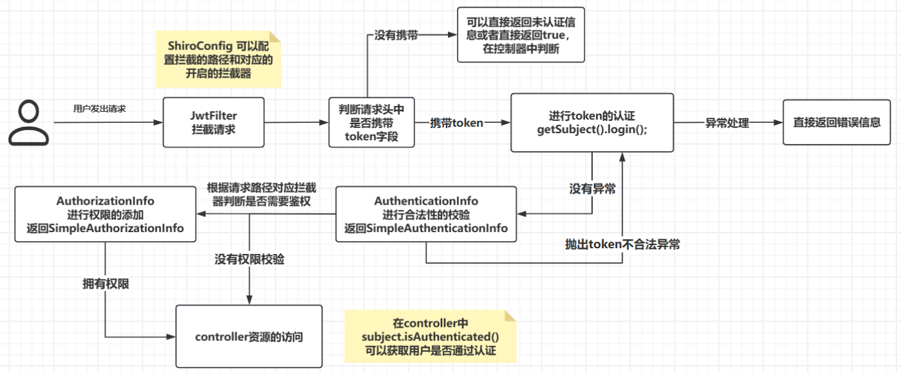
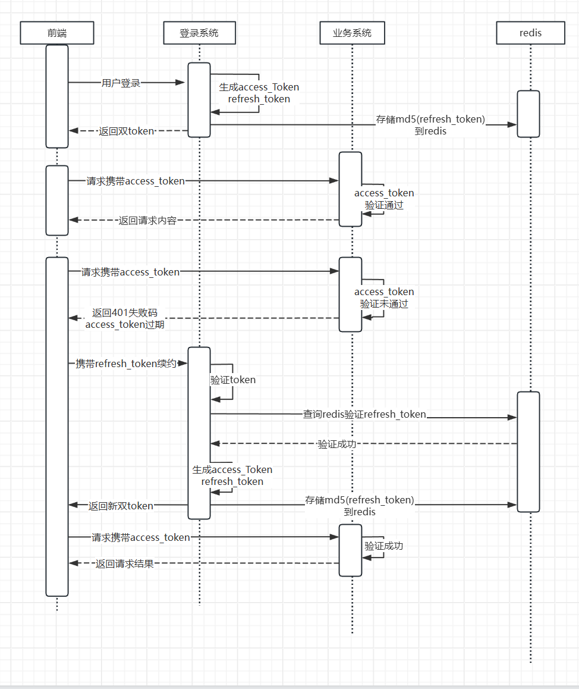
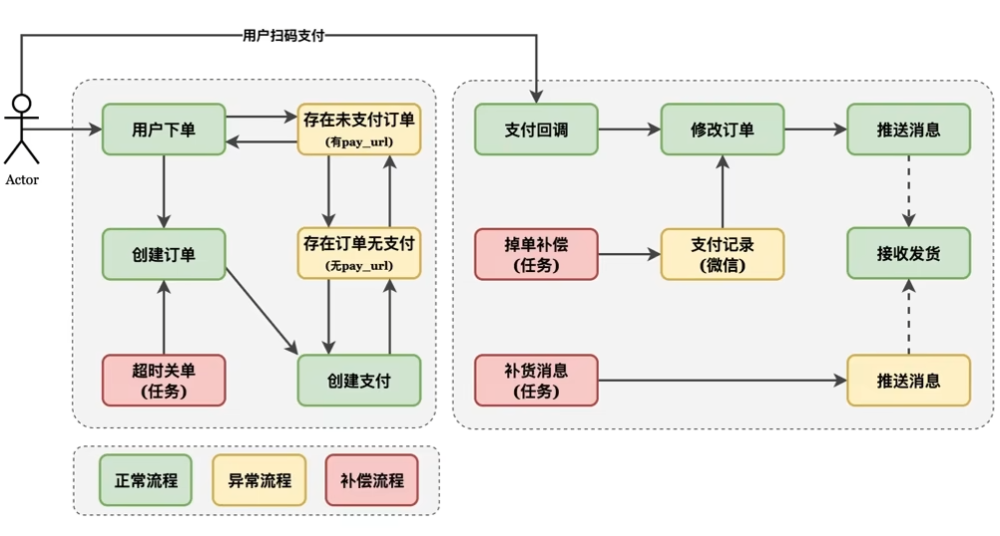

# OpenAI项目

这个项目的核心功能包括：**微信公众号认证，通过关注微信公众号获得验证码**、**对接各类大模型的OpenAI-sdk：例如chatGPT、文心引言、智谱AI、同时自定义注解和AOP的方式设计限流组件、**对模型生成的内容进行各种**规则校验和敏感词校验**、最后通过sse模型实现模型的**流式应答、**项目中使用策略模式、工厂模式、模板模式大量的简化代码代码拥有较好的扩展性

## 1.单Token

### 1.1 JWT简介

**JWT token的令牌格式：**

- Header采用的加密算法和类型

  - 使用HS256加密算法
- Payload ==**有效载荷-任何人可以看到-不能放敏感信息**==

  - **本次项目中使用 openId作为有效载荷**
- 签发人，也就是JWT是给谁的（逻辑上一般都是username或者userId）
- Signature-签名

  - 保证上面信息不会被篡改

  - **HMACSHA256( base64UrlEncode(header) + "." + base64UrlEncode(payload), secret)**
  - **对称加密算法，自定义一个加密的密钥，别人就无法伪造token信息**

### **1.2 验证过程**

**Java服务端可以安全地验证JWT的合法性，根据Payload中的字段信息进行用户身份认证**

**拦截JWT**：通过Spring的`HandlerInterceptor`接口，编写自定义拦截器，从请求头中提取JWT。

**验证JWT**：拦截器解析并验证JWT的签名和过期时间，确保令牌合法。

**注册拦截器**：通过Spring的`WebMvcConfigurer`配置拦截器，确保其能拦截指定的请求。

**使用JWT信息**：在通过拦截器的请求中，可以通过`HttpServletRequest`获取用户的身份信息。

### 1.3 cookie、session和token

http协议是无状态的，服务端是不知道请求是不是同一个客户端，三种方案

cookie：用户登录成功之后，服务端生成一个cookie返回客户端，客户端下次请求携带cookie，Cookie 存储在客户端，可能会被窃取或篡改，因此对敏感信息的存储需要进行加密处理；

session：用户登录成功之后，服务端根据用户的数据，生成一个sessionId，session本质上是通过sessionId来关联用户的敏感信息，因为用户的敏感信息不能存储在浏览器端。session是存放在服务端，客户端每次请求通过cookie携带相应的seesionID

Token机制：Token 机制不需要在服务器上保存任何关于用户的状态信息，只需要在登录成功时，服务器端通过某种算法生成一个唯一的 Token 值，之后再将此 Token 发送给客户端存储（存储在 **localStorage 或 sessionStorage** 中）并且服务端是不存储这个token的，服务端只进行校验。

Cookie 是应用程序通过在客户端存储临时数据，用于实现状态管理的一种机制；Session 是服务器端记录用户状态的方式，服务器会为每个会话分配一个唯一的 Session ID，并将其与用户状态相关联；Token 是一种用于认证和授权的一种机制，通常表示用户的身份信息和权限信息。

## 2.双Token机制

长短token三验证

两个token：长短token的意义是过期时间的长短，不是字符串的长度

- access_token:用来验证，正常的业务请求 30分钟
- refresh_token：用来续约 3天

具体的流程：

1.正常用户登录之后，生成双token，将refresh_token的md5存入redis

2.前端访问业务接口的时候携带access_token进行访问，==业务系统验证token的有效性（时间+解析用户）==

3.验证成功，执行业务代码

4.验证失败，如果是token过期，使用refresh_token访问续约的接口

5.==验证refresh_token的有效性==&&再次和redis中存储的md5值进行比对

6.生成一对新的access_token 和 refres_token，把新的refresh_token的md5值放到redis中

7.前端携新的access_token进行访问

**`重点在于refresh_token的一次性`**

### 相关问题

#### 为什么使用双Token？

#### 为什么需要把Token变为有状态的？

#### 长token变为一次有效，为什么不直接使用单token

## 3.AOP和限流算法

### 3.1 AOP的底层原理

AOP面向切面编程，实现方法的解耦，在不改变源码的基础上，扩充方法。

常见的有两种方式实现AOP，AspectJ和SpringAOP

先说第一种：在Java的底层JVM虚拟机执行的是字节码文件，我们编写的是Java文件，想要在不改变源码的基础上扩充源码，那我们就可以在.java文件编译成.class文件的过程中，扩充字节码文件，这样JVM在真正执行的时候就是执行扩充之和的方法，这个就是AspectJ实现AOP的原理，也是我们常用的Lombok注解的底层原理

第二种：SpringAOP的实现，主要依靠的是动态代理，既然需要在不改变方法的基础上扩充方法，也可以直接生成一个新的类，覆盖掉原来类。在Spring中如果一个类实现接口，底层就会用JDK动态代理的方式新建代理类，如果没有实现接口，使用CGLIB动态代理，生成一个子类，重写父类的方法，生成代理类放入Map，后续通过代理类调用方法，就会走到扩展的逻辑

从Spring源码的角度来看，AOP其实是IOC的一个扩展，在SpringIOC过程中，类的实例化和初始化分开，在初始化的过程中，当Bean的属性填充之和，会有一个BeanFactoryPostProcess，Bean的后置处理器，我们使用@EableAuto注解后，在创建Bean的时候，会注入一个Bean的后置处理器，然后在bean的初始化过程中，调用bean的后置处理器通过切面表达式，找到满足条件的bean,创建一个代理对象方法Map

JDK的动态代理：

- 主要是目标类实现了接口
- JDK 动态代理是通过 `java.lang.reflect.Proxy` 类生成的，利用反射生成一个代理类，`Proxy` 类的一个限制是它只能代理实现了接口的类。JDK 的动态代理利用接口来定义方法的签名，并通过 `InvocationHandler` 实现方法的具体逻辑。
- 生成一个代理类，方法名啥的都一样，但是调用原来的方法的时候，回调用到InvocationHandler中的invoke方法（有一点像适配器模式）

CGLIB实现动态代理：

- 主要是通过子类重写父类的方法，实现代理模式
- CGLIB 动态代理通过实现 `MethodInterceptor` 接口，在代理类的方法调用时拦截方法调用，并在调用前后添加自定义逻辑，类似于 JDK 动态代理中的 `InvocationHandler`

### 3.2 常见的限流算法

#### 1.固定时间窗口限流

实现的原理：

在指定周期内累加访问次数，当访问次数达到设定的阈值时，触发限流策略，当进入下一个时间周期时进行访问次数的清零

具体实现：

- 通过注解标识需要频控的方法，设置time和count
- 通过往redis中设置key和过期时间完成具体的实现
- 每个调用登录的方法，incr（key）
- 保证key的唯一性：limit：username：方法名称：IP地址
- 通过AOP的前置通知，查询redis中已经访问的次数判断是否超过限制（考虑一下登录成功之后是否清空redis）

缺点：

- 限流不平滑，限流是每秒3个，在第一毫秒发送了3个请求，达到限流，窗口剩余时间的请求都将会被拒绝，体验不好。
- 无法处理临界问题：例如3秒内现在3次，2-3秒3次，3-4秒3次 这个2秒内就6次了

#### 2.滑动窗口限流

滑动窗口在固定窗口的基础上，将时间窗口进行了更精细的分片，**将一个窗口分为若干个等份的小窗口**，每次仅滑动一小块的时间。每个小窗口对应不同的时间点，拥有独立的计数器，

实现的核心步骤：

1.把3秒钟划分为3个小窗，每个小窗限制请求不能超过50秒。

2.比如我们设置，3秒内不能超过150个请求，那么这个窗口就可以容纳3个小窗，并且随着时间推移，往前滑动。每次请求过来后，都要统计滑动窗口内所有小窗的请求总量。

缺点：

- 存在限流不够平滑，：限流是每秒3个，在第一毫秒发送了3个请求，达到限流，剩余窗口时间的请求都将会被拒绝，体验不好。
- 如果时间窗口划分的很小和固定时间窗口限流类似

#### 3.漏桶算法

漏桶限流算法是一种常用的**`流量整形（Traffic Shaping）`**和**`流量控制（Traffic Policing）`**的算法，它可以有效地控制数据的传输速率以及防止网络拥塞

**流量整形**：数据包以不同的速度到达漏桶，但只能以固定的速率流出。因此，即使输入流量可能是不稳定的突发流量，输出流量也会被控制为恒定的速率，从而起到**平滑流量**的作用-平滑流量

**流量控制**：如果漏桶中积累的流量超过了桶的容量（即数据包的突发量过大），超出的部分将会被丢弃，这可以用于防止网络拥塞-控制数据注入网络的速度。

漏桶是一个很形象的比喻，外部请求就像是水一样不断注入水桶中，而水桶已经设置好了最大出水速率，漏桶会以这个速率匀速放行请求，而当水超过桶的最大容量后则被丢弃。不管上面的水流速度有多块，漏桶**水滴的流出速度始终保持不变。**

核心步骤：

a.一个固定容量的漏桶，按照固定速率出水（处理请求）；

b.当流入水（请求数量）的速度过大会直接溢出（请求数量超过限制则直接拒绝）

c.桶里的水（请求）不够则无法出水（桶内没有请求则不处理）

缺点：

- 如果入口流量过大，超过了桶的容量，那么就需要丢弃部分请求。在一些不能接受丢失请求的场景中，这可能是一个问题。
- 可能会造成资源的浪费，不管当前系统的负载压力如何，所有请求都得进行排队，即使此时服务器的负载处于相对空闲的状态，这样会造成系统资源的浪费。

#### 4.令牌桶限流

令牌桶算法是基于漏桶算法的一种改进，主要在于**令牌桶算法能够在限制服务调用的平均速率的同时，还能够==允许一定程度内的突发调用==**。

只有令牌足够多，可以一次性处理多个请求

1.系统以固定的速率向桶中添加令牌；

2.当有请求到来时，会尝试从桶中移除一个令牌，如果桶中有足够的令牌，则请求可以被处理或数据包可以被发送；

3.如果桶中没有令牌，那么请求将被拒绝；

4.桶中的令牌数不能超过桶的容量，如果新生成的令牌超过了桶的容量，那么新的令牌会被丢弃。

5.令牌桶算法的一个重要特性是，**它能够应对突发流量。当桶中有足够的令牌时，可以一次性处理多个请求**，这对于需要处理突发流量的应用场景非常有用。但是**又不会无限制的增加处理速率导致压垮服务器，因为桶内令牌数量是有限制的**。

代码实现：

Guava中的RateLimiter就是基于令牌桶实现的，可以直接拿来使用。

缺点：

可能导致过载：如果令牌产生的速度过快，可能会导致大量的突发流量，这可能会使网络或服务过载。

## 4.敏感词校验算法

// TODO

自定义的敏感词算法

AC自动状态机算法，匹配多个敏感词，可以输出敏感词的位置

## 5.设计模式

## 6.支付流程

### 6.1 整支付流程：

分为三部分：**下单过程、支付回调过程、发货的过程、补偿机制**

#### 1.下单过程

主要有**订单和支付单**两个概念

1.用户点击的下单

2.开始创建订单

- 商品id和用户id查询账号是否有未支付的订单 
- 主要看order_status  pay_url

2.1 订单状态为创建完成并且有pay_url（订单和支付单都是完成的）直接返回pay_url

2.2 订单状态为创建完成且无pay_url(订单创建完成，支付单未完成) 创建支付单

​	一定要写入一个**orderId（out_trade_no）**支付回调的时候会返回orderId和**支付回调地址（notify_url）**

​    **更新支付单状态-等待支付，写入pay_url**

2.3 首次下单

​	先保存订单的信息，创建支付单（一个是写数据库，一个是http请求，无法进行事务）

​	一定是先保存订单信息，因为需要orderId，而且肯定是现有订单，再有支付单

#### 2.支付回调的过程

1.有一个通过RSA验证参数的过程

2.取出tradeNo（这个就是写入订单号）[交易状态、支付宝交易凭证号、订单号、支付宝唯一id、买家付款时间、金额 ...]

3.更新支付单和订单的状态（订单：等待发货、支付单：支付完成）

- **`可以插入的条件是orderId和回调的orderId相等并且支付时间为null（oderId添加唯一索引）`**
- **`插入成功之后，生产者发送消息`**（解耦发货的流程）

#### 3.发货的流程

**同一个事务中**

1.消费者接受到消息，开始发货

2.更改订单的状态-发货完成 为用户的账户添加额度（同一个事务，插入失败抛出异常,进行回滚）

- **订单状态为等待发货，才可以插入，才可以新增用户的额度**

#### 4.补偿机制

三大定时任务：

- 超时关单-对于订单创建完成，支付状态为等待支付超过半小时的，主动向支付宝关单（orderId）AlipayTradeCloseRequest
- 支付回调失败-对于订单创建完成，支付状态为等待支付，时间超过1分支，主动向支付宝查询（orderId）AlipayTradeQueryRequest
- 发货失败进行补发-对于订单状态为等待发货，支付状态为支付完成，时间超过1分钟的，执行生成者发送消息

### 6.2 相关问题

#### 1.重复下单

- 前端防抖-下单之后，下单按钮置灰
- 后端业务逻辑：下单之后，返回同一个pay_url
- 分布式锁：
  - key：用户Id+商品Id set key value nx ex 设置短暂的过期时间

#### 2.多次回调

多次回调保证不多发货 transactionId（支付单号）

我的项目里面是依靠数据库完成幂等性，订单id作为条件，并且支付时间为null transactionId唯一索引 才会把订单状态改成等待发货，只有修改成功才会发货多余的调用，插入数据库不会成功，也就不会发货

如果是分布式的场景，数据库不能依赖

利用类似分布式锁：使用transactionId或者orderId作为key

set key value nx ex 锁定时间为 10 秒
