# Redis相关

## 1.Redis的数据结构

**首先Redis的常用的几种数据结构：5+3**

String、List、Hash、Set、ZSet、BitMap、GEO、hyperloglog

String 类似 java中的Map，存储的就是k，v 有个加减1的操作

List是双端列表，比如微信的公众号消息或者评论

Hash相当于Java的Map<String,Map<Objeetc,Object>>，value是一个对象，比如如果实现一个类似购物车的功能

Set：不允许重复，可以随机弹出元素

ZSet：每个元素都会有一个分数，可以排名

BitMap：存储的01 二进制数组

hyperloglog：用于一些基数统计（不包含）DAU 日活

GEO地理位置：

- 将三维的地球变为二维的坐标
- 在将二维的坐标转换为一维的点块
- 最后将一维的点块转换为二进制再通过base32编码

**其次，每种数据类型其实在redis的底层是不区分的，有一个共同的RedisObject对象**


redisObject的结构体里面，有一个type字段，用来区分string、list、hash、set、zset

其中还有一个 *ptr 指针，这个指针指向的是真正存储数据的地方

**下面依次说一下几种数据类型的真正数据结构**

String类型，String有三种方式存储

- int 保存在long的64位范围内的整数

- embstr 数据就存储在ptr指针的下面 字符串长度小于44

- SDS（简单动态字符串） ptr指向指向的就是SDS的结构体

  

Hash类型，有两种存储方法：压缩列表（ziplist）和哈希表（HashTable）

[Redis：hash类型底层数据结构剖析-阿里云开发者社区 (aliyun.com)](https://developer.aliyun.com/article/1346861)

压缩列表本质上就是字节数组，一堆01，会将存储的内容编码


主要是通过记录上一个entry的长度，通过长度的计算获取下一个元素，不是使用链表的pre和next

HashTable的底层数据结构：字典

ptr指向会指向一个字典

**每个哈希表节点保存一个键值对，每个哈希表由多个哈希表节点构成，而字典则是对哈希表的进一步封装**。


其中，dict代表字典，dictht代表哈希表，dictEntry代表哈希表节点。可以看出，dictEntry是一个数组，这很好理解，因为一个哈希表里要包含多个哈希表节点。而dict里包含2个dictht，多出的哈希表用于REHASH。

// ReHash的过程-大致需要看一下

List的底层数据结构：quckList快速链表 LinkedList + zipList


Set的底层数据结构：inset和hashTable

inyset存储整数的结构体

hashtable字典

Zset的数据结构：zipList和skipList


利用类似二分查找，建立冗余索引，时间复杂度为logn

为什么不使用B+树：

- 设计的目的不同：MySQL中，为了减少磁盘的IO次数，需要存储的树尽量的低，三层b+树是可以索引千万级别的数据，b+树的插入和删除都会涉及树的分裂和合并，redis就是在内存中，不在意查询的次数，不需要考虑树的平衡，需要简单的设计即可
- 占用空间：B+树的指针管理和实现都比跳表复杂
- 1，时间复杂度方面：大部分情况下，跳跃表的效率和平衡树媲美；
  2，算法实现方面：跳跃表的实现比平衡树、b+树更为简单；
  

## 2.Redis实现分布式锁

### 2.1 单机分布式锁

锁的分类：

- 单机锁：同一个JVM虚拟机内，synchronized或者lock接口
- 分布式锁：锁不同的JVM虚拟机，单机锁不起作用，资源类在不同的服务器之间共享

普通的redis锁的加锁过程：

1.最简单的版本

set if not exist，如果存在key设置失败

```mysql
setnx key value 
```

存在的问题：持有锁的服务崩了，导致一直无法释放锁

2.使用Redis自带的原子命令,增加设置锁的过期时间：

```mysql
setnx key value nx ex 100
```

这个命令的作用如下：

- `SETNX key value`：如果 `key` 不存在，则设置 `key` 的值为 `value`。
- `NX`：此选项确保只有在 `key` 不存在的情况下才执行设置操作。
- `EX 100`：设置 `key` 的过期时间为 100 秒。

3.过期时间的设置和删掉别人的锁

对应的解决办法

- 锁的续约，看门狗机制
- 每个锁区分一下，保证锁不会被误删 UUID

4.判断锁是否属于自己和删除锁之间没有原子

先判断在删除，判断的时候确实是自己的，但是判断之后立马被别的线程设置锁，原本线程删除的时候，删了别人的锁

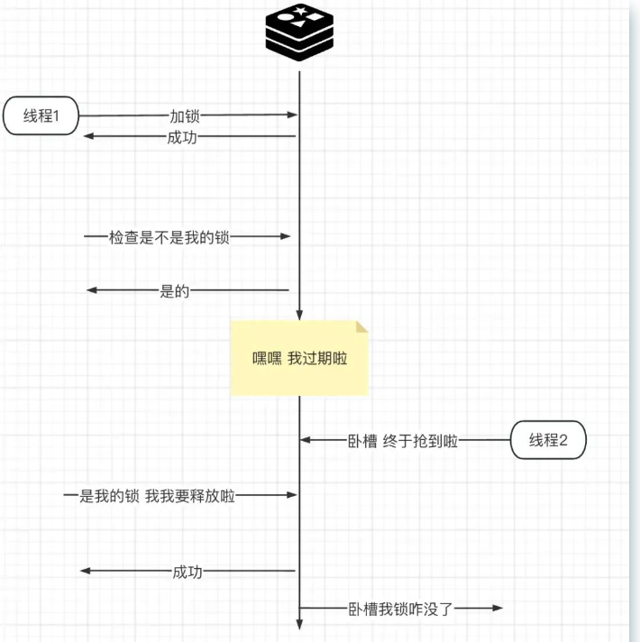

5.使用LUA脚本，保证判断和删除都是原子性的

```lua
"if redis.call('get', KEYS[1]) == ARGV[1] " +
"then " +
"return redis.call('del', KEYS[1]) " +
"else " +
"   return 0 " +
"end";
```

总结：

- **主要通过setnx方式，设置一个有过期时间并且和客户端相关的独特key**
- **解锁的过程：主要通过Lua脚本保证判断和删除操作的原子性，以此保证只能删除自己的锁。**

### 2.2 Redisson

单机版还有无法解决的问题，

- 单机的redis直接挂掉，主从也无法解决 线程1先获得锁，将对应的key-value写入主机 master 在主机将该键值对同步到从机slave之前,发生故障

  redis触发转移，将其中一个slave设置为新的master 但是此时新的master根本不包含线程1的key-value 线程2这时候来获取锁，发现没有加锁。获取锁成功。

- 锁的过期时间的限制

基于Redission的分布式锁：

Redission是基于 **Redlock 的算法，是RedLock算法的Java实现**

**解决上述的主从问题**：Redission直接将所有的从机全部变为主机，一个加锁的key由多个redis客户端去维护，它会对集群中的每个 Redis，**挨个去执行设置 Redis 锁的脚本**，也就是集群中的每个 Redis 都会包含设置好的锁数据。

例如：将三个redis客户端全部设置为master，同时加锁。如果有一个出现意外，去其余两个获取锁。完成分布式多机锁。

**对于解决设置锁过期时间：通过看门狗机制**

客户端加锁成功，就会启动一个watch dog看门狗，他是一个后台线程，会每隔10秒检查一下，如果客户端还持有锁key，那么就会不断的延长锁key的生存时间，默认每次续命从30秒新开始 当30秒结束之后线程还没有续约，锁自动释放。避免了死锁的产生。

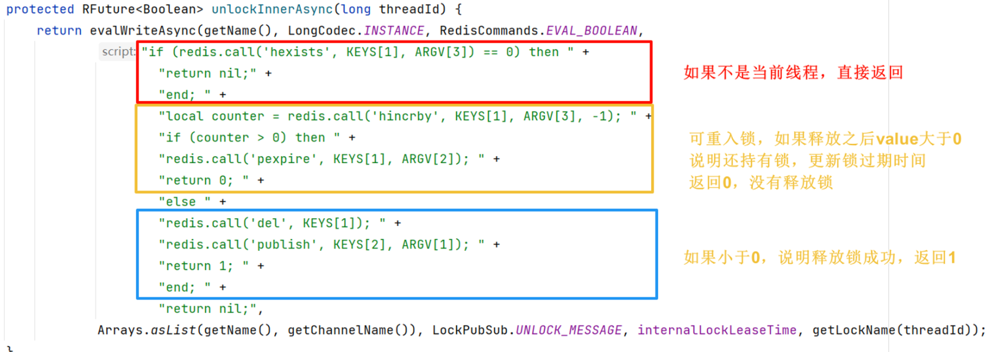

## 3.Redis的内存管理

### 3.1 redis持久化策略

**RDB快照**

- 创建数据库在某个时间点的快照（存储所以key-value的二进制文件 dump.rdb）
- 通过save命令 save 900 1（如果在900秒内至少有1个键被修改，则自动生成一个快照）阻塞主线程
- bgsave触发，不会阻塞主线程fork子线程
- 优缺点：
  - 恢复快，适合备份和传输
  - 有数据丢失风险（两次RDB之间宕机） 耗时长

**AOF命令**

- 将redis的命令追加写的方式添加到AOF文件的末尾，根据AOF的命令重建数据库
- always-每个命令 everysec-每秒 no-操作系统
- 优缺点
  - 记录的是命令，丢失数据风险小
  - 文件体积大，恢复速度慢，每次磁盘IO，降低redis的性能
- 重写机制：分析现有的键值对状态，生成能够恢复当前数据库状态的最小命令集，并将这些命令写入到一个新的AOF文件中，最后替换掉旧的AOF文件。

**混合模式**

Redis首先生成一个**RDB快照，然后将后续的写操作命令以AOF格式追加到快照文件的末尾**。这种方式结合了RDB恢复速度快和AOF数据安全性高的优点，使得数据恢复既快速又安全。

如果Redis只用**缓存服务器**，对数据库查询的数据做缓存，可以**关闭持久化**，因为缓存服务器失效，还能从数据库获取恢复。

如果要保证数据的安全性，两种方式都开启；如果可以接收一段时间内的数据丢失，可以只开启RDB。

使用**主从复制**机制弥补持久化时性能上的影响，在Master上保证读写性能，**Slave上同时开启RDB和AOF**（混合持久化）保证数据的安全。

### 3.2 redis缓存删除策略

**Redis过期数据的删除策略**

常用的过期数据删除策略：

- 惰性删除：会在取出 key 的时候才对数据进行过期检查，对cpu友好，可能存在大量过期的缓存
- 定期删除：每隔一段时间抽取一批key，删除过期的key。redis底层会限制操作的频率和时间来限制对cpu的影响

但是可能还是会删不干净，有些key会有遗留，就要使用内存淘汰策略

**Redis的内存淘汰策略**

1.默认-noeviction 直接报错

2.设置过期时间的数据：

- allkeys-random：随机删除
- allkeys-lru：使用 LRU 算法进行筛选删除
- allkeys-lfu：使用 LFU 算法进行筛选删除

3.全部的key allkeys 开头的策略是针对所有数据的，如果数据被选中了，即使过期时间没到，也会被删除

- volatile-random：随机删除

- volatile-ttl：根据过期时间先后进行删除，越早过期的越先被删除

- volatile-lru：使用 LRU 算法进行筛选删除

- volatile-lfu：使用 LFU 算法进行筛选删除

**LRU：最近最久未使用**（Hash表+双向链表，Hash表保证查找，双向链表插入和删除）

基于访问时间，对于访问时间进行，Redis 会为每个键维护一个访问时间戳，记录访问的时间。当需要腾出空间时，Redis 会比较所有键的时间戳，淘汰那些最久未被访问的键。

**LFU：基于访问频率**

Redis 为每个键维护一个访问计数器，每次访问该键时计数器会递增。**访问频率不能等同于访问次数**，FU算法一般都会有一个时间衰减函数参与热度值的计算，兼顾了访问时间的影响。Redis 会在达到内存上限时，淘汰**数据的访问次数**最低的键。

**为什么有LRU还会有LFU，或者说LRU有什么缺点？**

LRU无法正确的表示一个Key的热度，如果一个key从未被访问过，仅仅发生内存淘汰的前一会儿被用户访问了一下，在LRU算法中这会被认为是一个热key。

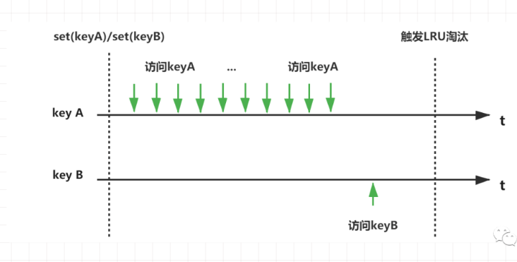


## 4.缓存击穿、穿透、雪崩

### 4.1 缓存击穿：

> redis中原来有，突然失效，然后大量的请求打到数据库上面去，热点缓存失效，暴打MySQL

**互斥更新：参考单例模式双端检索，锁的方式**

分布式锁场景，在访问key之前，采用SETNX（set if not exists）来设置另一个短期key来锁住当前key的访问，访问结束再删除该短期key。

这种现象是多个线程同时去查询数据库的这条数据，那么我们可以在第一个查询数据的请求上使用一个 互斥锁来锁住它。

其他的线程走到这一步拿不到锁就等着，等第一个线程查询到了数据，然后做缓存。后面的线程进来发现已经有缓存了，就直接走缓存。

这个就很危险，超高并发下这个短暂的过程足已让千千万万请求投向数据库。**更别提这可能是个慢查询，整个过程可能长达2s以上，那对数据库是一种非常大的伤害。**

redis中没有的时候，开始去数据库查找，访问数据库的时候添加一个互斥锁，在锁里面继续再次查询一次redis，其余的线程无法拿到锁，进行等待，当抢到锁的线程，再将数据回写Redis

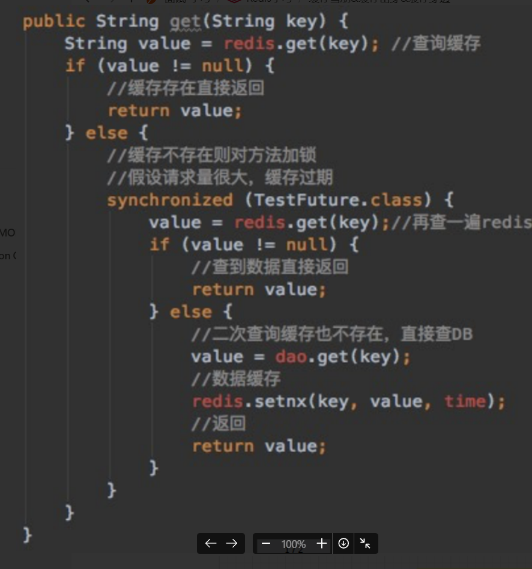

**空初始值，短暂的局部降级**

第一个请求将缓存的key对应的value设置为默认值或者空值

从数据库检索到数据的时候，放回更新到缓存当中。中间可能有一些请求获取到不正确的信息，但是总体保证了系统的稳定性


### 4.2 缓存穿透：

> redis中本来就没有，每次都要去数据库中查询，redis成为摆设
>
> 疯狂模拟一些不存在的`Key`，让你进入数据库去取数，这样就可以拖垮你的数据库，实现击溃你系统的目的。

**1.缓存空值**

key的值设置为null，并写到缓存池中。后面再出现查询这个key 的请求的时候，直接返回null，这样就在缓存池中就被判断返回了，压力在缓存层中，不会转移到数据库上。

**2.业务层判断key是否符合要求，先过滤无效的key，**

**3.使用布隆过滤器**

选择解决的角度：

- key非常多、请求重复率比较低的数据，我们就没有必要进行缓存，使用 BloomFilter 直接过滤掉。
- 于空数据的key有限的，重复率比较高的，我们则可以采用 缓存空值的办法进行处理。 

布隆过滤器的原理

> 本质：很长的二进制数组+一系列的hash函数

添加元素：

使用多个hash函数对key进行运算，在和数组的长度进行取模，计算得到多个位置，将每个hash函数计算出来的位置置为1，就完成存储的操作

查询元素

根据多个hash函数计算出的索引，去bit数组中查询，如果有一个位置为0，一定不存在。但是全部为1，不是一定存在。可能发生hash碰撞，其他的key计算的时候，将这个位置置为1了

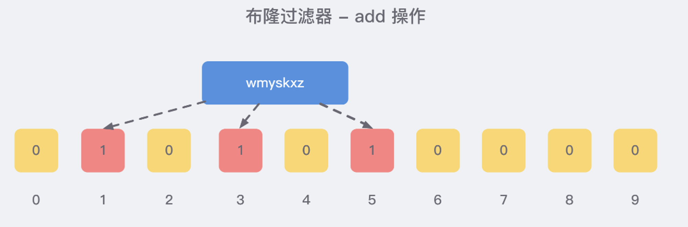

穿透的解决：

- key是redis中没有的，布隆过滤器判断
  - hash桶全是1，可能存在，放行 其实是发生了误判
  - hash桶存在0，一定不存在，不放行，拦截住了

布隆过滤器，不能把元素删除，因为一个桶位置上面的1，可能是好几个元素的1。

扩展：布谷鸟过滤器

### 4.3 缓存雪崩：

> 1.缓存雪崩是指大量的key设置了相同的过期时间，导致在缓存在同一时刻全部失效，造成瞬时DB请求量大、压力骤增，引起雪崩。
>
> 2.redis突然崩溃

**1.缓存集群+数据库的集群**

数据库的读写分离，一主N从

**2.适当的限流和降级**

 Google的RateLimiter 限流

常见的限流算法：// TODO

Google的RateLimiter 都是不错的选择。

**3.差异化更新时间**

n * 3/4 + n * random() 。所以，比如你原本计划对一个缓存建立的过期时间为8小时，那就是6小时 + 0~2小时的随机值。
这样保证了均匀分布在 6~8小时之间

### 4.4 高QPS防范

**流量的削峰-消息队列：将并发的请求转变为串行**

这时候关心是不是及时拿回正确数据已经不重要了，保住你的缓存和数据库不被击穿才是关键。
队列的目的是让并行变成串行，这一定程度上降低系统处理用户请求的吞吐能力，但是却能很好的缓解你服务的压力和风险。


**集群模式和自动扩缩容模式**

从服务到缓存到数据层都应该具备，否则无法根据流量来进行弹性伸缩，保持高可用。
如下图， 蓝色部件是扩容的部分，每一分层都有自己的动态扩容机制。

## 5.缓存双写一致性

缓存和数据库追求的是最终一致性，肯定会出现缓存不一致的情况。

缓存-数据库的双写

- 更新缓存，更新数据库
  - 直接pass
- 先删缓存，在更新数据库
  - 导致缓存删不干净，线程A更新数据库的同时，线程B读取数据库的旧值，写入数据库，导致Redis是旧值。
  - 解决办法：
    - 延迟双删，写完db成功之后再次删除db中的值
- 先更新数据库，在删除缓存

使用异步的方式，类似MySQL的主从复制，通过监听Binlog日志，解析Binlog日志，异步更新缓存

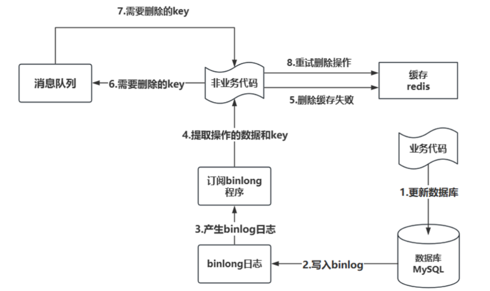

## 6.Redis的高可用

### 6.1 主从架构

配置命令

```shell
# 配置主从复制
replicaof 192.168.0.60 6379 # 从本机6379的redis实例复制数据，Redis 5.0之前使用slaveof
replica‐read‐only yes # 配置从节点只读
```


架构图

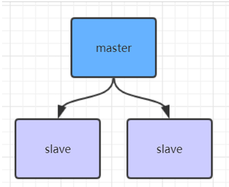

#### **主从复制-全量**

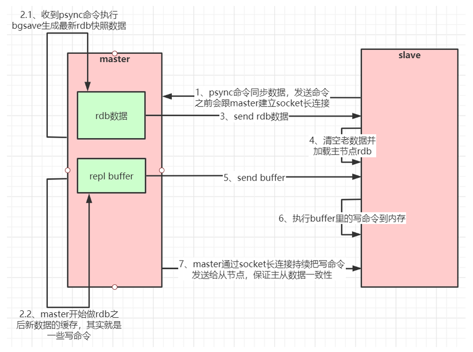

主从复制的过程

- slave节点连上master节点，会发送一个psync命令同步数据
- 收到psync命令执行bgsave生成最新的rdb快照数据
- 将rdb数据发送给slave，slave清空数据并开始加载master节点发来的rdb文件
- 在同步的过程中，master可能还被调用，会将调用的命令写入repl buffer
- master将repl buffer中缓存的命令发送给slave，slave执行命令，完成回放
- master通过socket长连接把命令发送给从节点，保证数据的一致性

#### **数据部分复制-增量**

整个过程类似断点续传

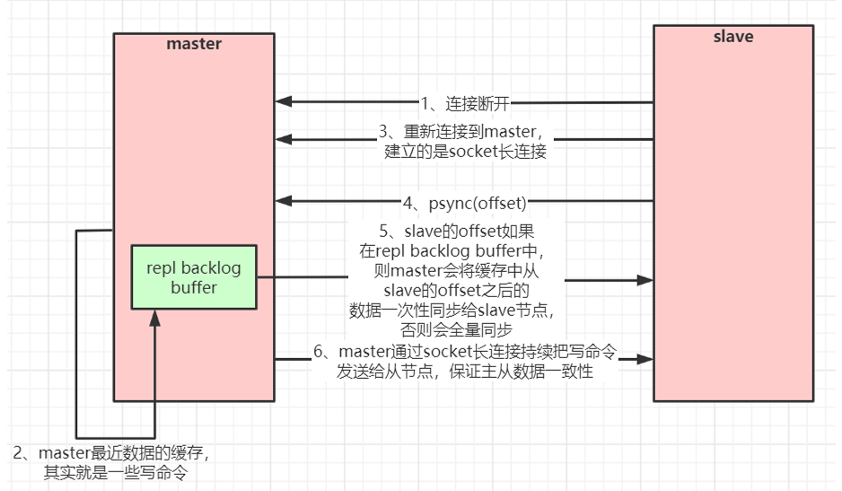

slave断开一段时间重新连接数据同步过程

- 断开连接从新连接后，slave发送psync命令，**`携带offset访问`**
- master主机收到这个offset
  - offset在master的repl backlog buffer里面，会将offset之后的命令一次性同步给slave节点
  - 不在里面，全量同步

- master通过socket长连接持续把写命令发送给从节点，保证数据一致性

#### 主从复制风暴

为了缓解主从复制风暴(多个从节点同时复制主节点导致主节点压力过大)，可以做如 下架构，让部分从节点与从节点(与主节点同步)同步数据

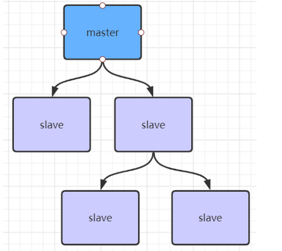

### 6.2 哨兵架构

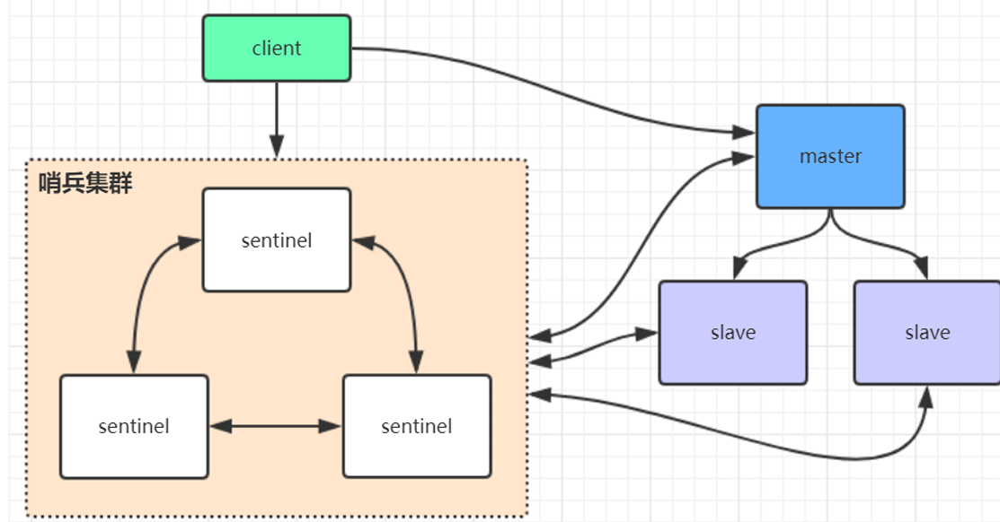

sentinel哨兵是特殊的redis服务，不提供读写服务，主要用来监控redis实例节点。 

哨兵架构下client端第一次从哨兵找出redis的主节点，后续就直接访问redis的主节点，不会每次都通过 sentinel代理访问redis的主节点，当redis的主节点发生变化，哨兵会第一时间感知到，并且将新的redis主节点通知给client端(这里面redis的client端一般都实现了订阅功能，订阅sentinel发布的节点变动消息)

**哨兵模式的缺点**

如果master节点异常，则会做主从切换，将某一台slave作为master，哨兵的配置略微复杂，并且性能和高可用性等各方面表现 一般，**特别是在主从切换的瞬间`存在访问瞬断`的情况**，而且哨兵模式只有一个主节点对外提供服务，没法支持 很高的并发，且单个主节点内存也不宜设置得过大，否则会导致持久化文件过大，影响数据恢复或主从同步的效率

因为所有的请求都同时打到一个master节点上，而且在选取新的slave作为master的时候服务会暂停

### 6.3 高可用集群模式

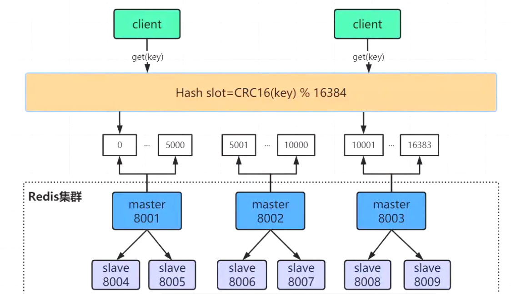

分片集群，每个master存储的都是分片的数据，并不是全部的数据

redis集群需要至少三个master节点，我们这里搭建三个master节点，并且给每个master再搭建一个slave节 点，总共6个redis节点

Redis Cluster 将所有数据划分为 16384 个slots(槽位)，每个节点负责其中一部分槽位。槽位的信息存储于每个节点中。 当 Redis Cluster的客户端来连接集群时，它也会得到一份集群的槽位配置信息并将其缓存在客户端本地。这样当客户端要查找某个key 时，可以直接定位到目标节点。同时因为槽位的信息可能会存在客户端与服务器不一致的情况，还需要纠正机制来实现槽位信息的校验调整

#### 槽定位算法

Cluster 默认会对 key 值使用 crc16 算法进行 hash 得到一个整数值，然后用这个整数值对 16384 进行取模 来得到具体槽位。

```java
 HASH_SLOT = CRC16(key) mod 16384
```

#### 跳转重定位

当客户端向一个错误的节点发出了指令，该节点会发现指令的 key 所在的槽位并不归自己管理，这时它会向客户端发送一个特殊的跳转指令携带目标操作的节点地址，告诉客户端去连这个节点去获取数据。客户端收到指令后除了跳转到正确的节点上去操作，还会同步更新纠正本地的槽位映射表缓存，后续所有 key 将使用新的槽位映射表。

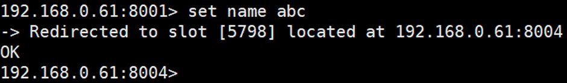

#### 网络抖动

真实世界的机房网络往往并不是风平浪静的，它们经常会发生各种各样的小问题。比如网络抖动就是非常常见 的一种现象，突然之间部分连接变得不可访问，然后很快又恢复正常。为解决这种问题，Redis Cluster 提供了一种选项 `cluster-node-timeout`，表示当某个节点持续 timeout 的时间失联时，才可以认定该节点出现故障，需要进行主从切换。如果没有这个选项，网络抖动会导致主从频繁切换 (数据的重新复制)。

#### Redis集群选举

当slave发现自己的master变为FAIL状态时，便尝试进行Failover，以期成为新的master。由于挂掉的master 可能会有多个slave，从而存在多个slave竞争成为master节点的过程， 

- slave发现自己的master变为FAIL 
- 将自己记录的集群currentEpoch加1，并广播FAILOVER_AUTH_REQUEST 信息 
- 其他节点收到该信息，**`只有master响应，判断请求者的合法性`**，并发送FAILOVER_AUTH_ACK，对每一个 epoch只发送一次ack 
- 尝试failover的slave收集master返回的FAILOVER_AUTH_ACK 
- slave收到**`超过半数master的ack后变成新Master`**(这里解释了集群为什么至少需要三个主节点，如果只有两个，当其中一个挂了，只剩一个主节点是不能选举成功的) 
- slave广播Pong消息通知其他集群节点。

从节点并不是在主节点一进入 FAIL 状态就马上尝试发起选举，而是有一定延迟，**一定的延迟确保我们等待FAIL状态在集群中传播**，slave如果立即尝试选举，其它masters或许尚未意识到FAIL状态，可能会拒绝投票，延迟计算公式：

```java
DELAY = 500ms + random(0 ~ 500ms) + SLAVE_RANK * 1000ms
```

SLAVE_RANK表示此slave已经从master复制数据的总量的rank。Rank越小代表已复制的数据越新。这种方式下，持有最新数据的slave将会首先发起选举（理论上）因为rank越小表示的数据越新，slave节点上的数据越多，或者说越接近master，成为master的概率应该越大，因此延迟时间就应该越小

#### 集群的脑裂问题

什么是脑裂问题：由于网络分区或其他问题，集群中的部分节点彼此失去通信，**导致多个主节点（Master）在同一时间为同一数据集服务**，网络分区导致脑裂后多个主节点对外提供写服务，一旦网络分区恢复，会将其中一个主节点变为从节点，这时会有大量数据丢失。 

规避方法可以在redis配置里加上参数(这种方法不可能百分百避免数据丢失，参考集群leader选举机制)： 

```shell
min‐replicas‐to‐write 1 
```

写数据成功最少同步的slave数量，这个数量可以模仿大于半数机制配置，比如 集群总共三个节点可以配置1，加上leader就是2，超过了半数 注意：这个配置在一定程度上会影响集群的可用性，比如slave要是少于1个，这个集群就算leader正常也不能提供服务了，需要具体场景权衡选择.

#### Redis集群为什么至少需要三个master节点，并且推荐节点数为奇数？ 

因为新master的选举需要大于半数的集群master节点同意才能选举成功，如果只有两个master节点，当其中一个挂了，是达不到选举新master的条件的。 奇数个master节点可以在满足选举该条件的基础上节省一个节点，比如三个master节点和四个master节点的集群相比，大家如果都挂了一个master节点都能选举新master节点，如果都挂了两个master节点都没法选举新master节点了，所以奇数的master节点更多的是从节省机器资源角度出发说的。
