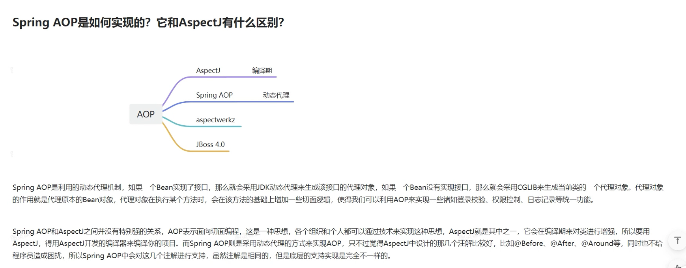
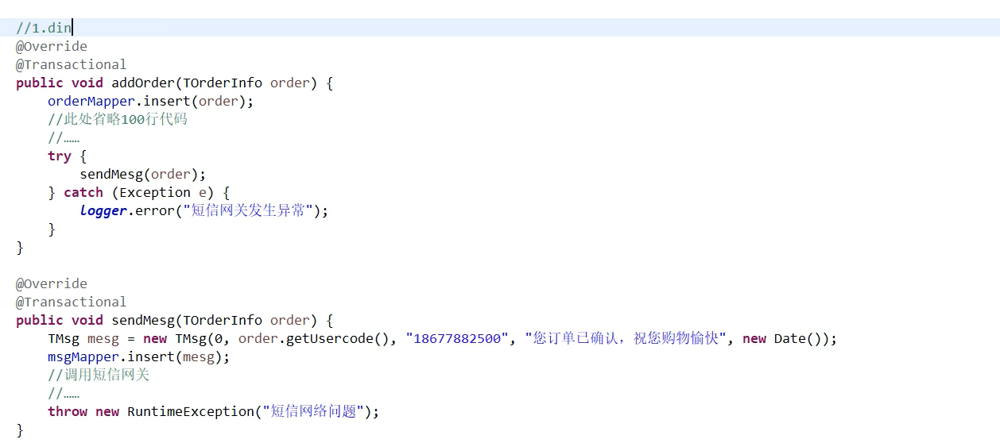
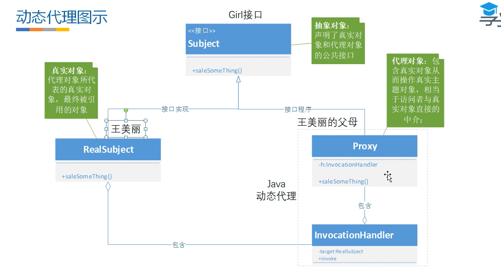

# SpringAOP和事务

## 1.声明式事务的原理

@Transactional 标识所在的类，被动态代理了

事务失效，两个表都

## 2.事务的传播

事务传播行为（propagation behavior）**指的就是当一个事务方法被另一个事务方法调用时，这个事务方法应该如何进行**。 

正常来说有几种解决方案： 

1. 融入事务：直接去掉serviceB中关于开启事务和提交事务的begin和commit，融入到serviceA的事务中。问题：B事务的错误会引起A事务的回滚。 

2. 挂起事务：如果不想B事务的错误引起A事务的回滚，可以开启两个连接，一个执行A一个执行B，互不影响，执行到B的时候把A挂起新起连接去执行B，B执行完了再唤醒A执行。 
3. 嵌套事务：MySQL中可以通过给B事务加savepoint和rollback去模拟嵌套事务，把B设置成伪事务。 

spring中的事务传播行为： 

1. PROPAGATION\_REQUIRED（需要）：如果存在一个事务，则支持当前事务。如果没有事务则开启一个新的事务。（A如果存在事务，则B融入A事务，如果没有则新起一个事务）大部分的修改操作使用 

2. PROPAGATION\_SUPPORTS（支持）：如果存在一个事务，支持当前事务。如果没有事务，则非事务的执行。（A有，则B融入，A没有，则非事务执行）大部分的查询操作 

3. PROPAGATION\_MANDATORY（强制性）：如果已经存在一个事务，支持当前事务。如果没有一个活动的事务，则抛出异常。（A有，则B融入，A没有，则抛异常） 

4. PROPAGATION\_REQUIRES\_NEW（需要新的）：如果一个事务已经存在，则先将这个存在的事务挂起。如果没有，则新起一个事务执行。（A有，则B挂起执行，A没有则新起一个事务） 

5. PROPAGATION\_NOT\_SUPPORTED（不支持）：总是非事务地执行，并挂起任何存在的事务。（A有，则挂起B非事务执行） 

6. PROPAGATION\_NEVER（从不）：总是非事务地执行，如果存在一个活动事务，则抛出异常。（A有，则抛异常） 

7. PROPAGATION\_NESTED（嵌套的）：如果一个活动的事务存在，则运行在一个嵌套的事务中。 如果没有活动事务, 则TransactionDefinition.PROPAGATION\_REQUIRED 属性执行。（A有，则B用savapoint方式嵌套执行与A）

(1)required适用于99.9%的修改性方法，A方法->B方法(B方法在A方法中被调用)，==传播行为修饰的是被调用的方法==，B方法需要一个事务，当A方法含有事务时，B方法加入A中；否则B方法自己创建一个事务。 

(2)support适用于99.9%的查询性方法，A有事务时，B会加入A事务；当A没有事务时，B会以非事务方式执行 

(3)mandatory表示B方法必须在==有事务==的A方法运行，否则会抛异常 

(4)require_new表示B方法需要一个新事务，当A方法含有事务时，A方法会被挂起，重开新链接开启一个新事务来运行B方法；当A方法没有事务时，B事务必须创建一个新事务，运行B方法。==当前方法必须运行在自己的事务中。== 

(5)not_support不支持事务，当A方法没有事务时，B方法以非事务方式运行；反之，A方法事务被挂起，以非事务的方式执行B事务 

(6)never表示B方法必须在==没有事务==的A方法运行，否则会抛异常

(7)PROPAGATION\_NESTED（嵌套的）：如果一个活动的事务存在，则运行在一个嵌套的事务中。 如果没有活动事务, 则TransactionDefinition.PROPAGATION\_REQUIRED 属性执行。（A有，则B用savapoint方式嵌套执行与A）

