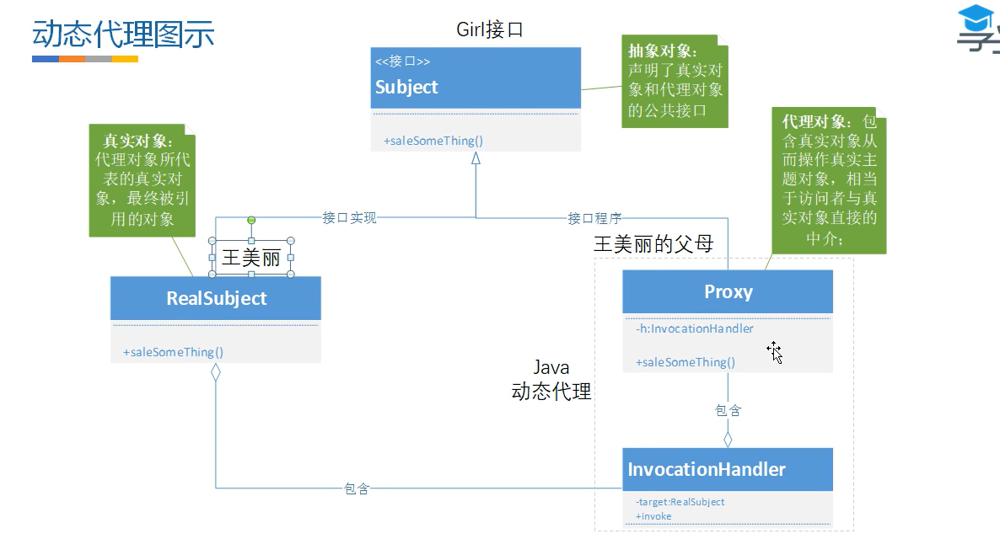
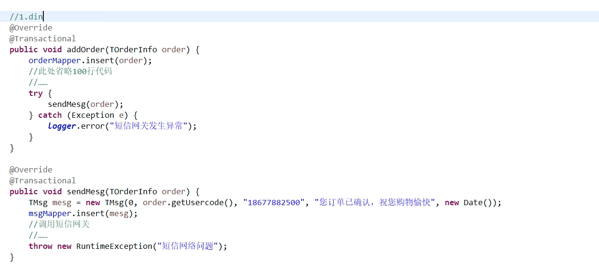

# Spring相关

## 1.声明式事务的原理

声明式事务的底层原理：使用AOP通过动态代理的方式对Transaction注解标识的方法所在的类，生产代理对象。

在Spring初始化bean时，会扫描bean中的每一个方法，看是否含有@Transactional注解，若有，则Spring会为bean创建一个代理对象，如果其他类需要依赖注入，注入的是当前类的代理对象，代理对象在执行方法之前，会将事务的自动提交关闭，setAutoCommit = false，正常执行完成提交事务，通过捕捉异常来完成事务的回滚。

## 2.事务的传播

事务传播行为（propagation behavior）**指的就是当一个事务方法被另一个事务方法调用时，这个事务方法应该如何进行**。 ==传播行为修饰的是被调用的方法==

正常来说有几种解决方案： 

1. **融入事务**：直接去掉serviceB中关于开启事务和提交事务的begin和commit，融入到serviceA的事务中。问题：B事务的错误会引起A事务的回滚。 

   A有事务

   - 就融入

   A没有事务

   - B开新事物：required
   - B不用事物：support
   - B抛出异常：mandatory 强制需要事务

2. **挂起事务**：如果不想B事务的错误引起A事务的回滚，可以开启两个连接，一个执行A一个执行B，互不影响，执行到B的时候把A挂起新起连接去执行B，B执行完了再唤醒A执行。 

   A有，就挂起，A没有事务：

   - B开新事物：required_new
   - B不用事物：not_support

3. **嵌套事务**：MySQL中可以通过给B事务加savepoint和rollback去模拟嵌套事务，把B设置成伪事务。 

   - A有事务，则嵌套
   - A没有事务
     - B开新事物：nested

4. PROPAGATION\_NEVER（从不）：总是非事务地执行，如果存在一个活动事务，则抛出异常。（A有，则抛异常）


spring中的事务传播行为： 

(1)required适用于99.9%的修改性方法，A方法->B方法(B方法在A方法中被调用)，B方法需要一个事务，当A方法含有事务时，B方法加入A中；否则B方法自己创建一个事务。 

(2)support适用于99.9%的查询性方法，A有事务时，B会加入A事务；当A没有事务时，B会以非事务方式执行 

(3)mandatory表示B方法必须在==有事务==的A方法运行，否则会抛异常 

(4)require_new表示B方法需要一个新事务，当A方法含有事务时，A方法会被挂起，重开新链接开启一个新事务来运行B方法；当A方法没有事务时，B事务必须创建一个新事务，运行B方法。==当前方法必须运行在自己的事务中。== 

(5)not_support不支持事务，当A方法没有事务时，B方法以非事务方式运行；反之，A方法事务被挂起，以非事务的方式执行B事务 

(6)never表示B方法必须在==没有事务==的A方法运行，否则会抛异常

(7)PROPAGATION\_NESTED（嵌套的）：如果一个活动的事务存在，则运行在一个嵌套的事务中。 如果没有活动事务, 则TransactionDefinition.PROPAGATION\_REQUIRED 属性执行。（A有，则B用savapoint方式嵌套执行与A）


1. PROPAGATION\_REQUIRED（需要）：如果存在一个事务，则支持当前事务。如果没有事务则开启一个新的事务。（A如果存在事务，则B融入A事务，如果没有则新起一个事务）大部分的修改操作使用 

2. PROPAGATION\_SUPPORTS（支持）：如果存在一个事务，支持当前事务。如果没有事务，则非事务的执行。（A有，则B融入，A没有，则非事务执行）大部分的查询操作 

3. PROPAGATION\_MANDATORY（强制性）：如果已经存在一个事务，支持当前事务。如果没有一个活动的事务，则抛出异常。（A有，则B融入，A没有，则抛异常） 

4. PROPAGATION\_REQUIRES\_NEW（需要新的）：如果一个事务已经存在，则先将这个存在的事务挂起。如果没有，则新起一个事务执行。（A有，则B挂起执行，A没有则新起一个事务） 

5. PROPAGATION\_NOT\_SUPPORTED（不支持）：总是非事务地执行，并挂起任何存在的事务。（A有，则挂起B非事务执行） 

6. PROPAGATION\_NEVER（从不）：总是非事务地执行，如果存在一个活动事务，则抛出异常。（A有，则抛异常） 

7. PROPAGATION\_NESTED（嵌套的）：如果一个活动的事务存在，则运行在一个嵌套的事务中。 如果没有活动事务, 则TransactionDefinition.PROPAGATION\_REQUIRED 属性执行。（A有，则B用savapoint方式嵌套执行与A）


## 3.AOP的实现原理

AOP是面向切面编程并不是Spring独有的，Spring中也支持AOP，本质上算是SPringIOC的一个扩展，不修改原有的方法，实现对方法的扩容，实现AOP常见的有两种方式：AspectJ和SpringAOP

先说一下AspectJ的实现，其实Java的jvm虚拟机底层执行的字节码文件，如果我能在源文件编译成字节码文件的时候，在相关的方法上进行修改，这样就形成了对方法的扩展。这个就是Aspect实现AOP的方式，这也是lombok注解的原理

在说一下Spring中AOP的实现原理，Spring中主要是依靠动态代理的方式实现AOP，如果一个Bean实现了接口，那么就会采用JDK动态代理来生成该接口的代理对象，如果一个Bean没有实现接口，那么就会采用CGLIB来生成当前类的一个代理对象。代理对象的作用就是代理原本的Bean对象，代理对象在执行某个方法时，会在该方法的基础上增加一些切面逻辑，使得我们可以利用AOP来实现一些诸如登录校验、权限控制、日志记录等统一功能。

从源码角度理解的话：

- @EnableAspectJAutoProxy注解 注入AnnotationAwareAspectJAutoProxyCreator这个BeanPostProcessor后置处理器
- 在bean实例化完成之后，执行注入的后置处理器，遍历bean池中的Advisor对象，根据Advisor中的
  PointCut判断当前bean是否满足条件，创建代理对象放入Map中

两种动态代理的方式：

**JDK 动态代理**：适用于目标类实现了接口的情况，使用标准 JDK 库实现。

**CGLIB 动态代理**：适用于目标类没有实现接口的情况，通过生成子类实现代理。

**JDK的动态代理：被代理的类需要实现接口**

具体的流程

- 通过实现 **InvocationHandler** 重写invoke方法，将增强的逻辑写在invoke方法
- **使用反射中创建代理类的方法，**newProxyInstance方法，该方法可以在运行时动态生成一个实现了指定接口的代理对象
- 该代理对象，在调用原来的方法的时候，会调用到InvocationHandler 中的invoke方法

本质就是：生成一个代理类，方法名啥的都一样，但是调用原来的方法的时候，回调用到InvocationHandler中的invoke方法

**CGLIB的动态代理**

通过继承机制，子类重写父类的方法，使用自定义MethodInterceptor调用父类的方法从而实现代理

通过实现**MethodInterceptor** **接口 实现** intercept方法完成，代理逻辑的增强

 **通过Enhancer 创建子类和设置方法拦截器，动态的创建代理对象**

**代理对象判断是否有实现**==MethodInterceptor （SetcallBack）接口，==如果实现就走接口的方法

## 4.AOP失效的场景

从Spring实现AOP的底层源码来看,想要让AOP生效，前提必须是**动态代理生效**，并且可以调用到代理对象的方法

- 私有方法 代理只针对公开的接口或类进行操作
- 静态方法 代理只能拦截实例对象的方法调用。而静态方法在类加载时就已经确定，并且调用时不依赖于对象，因此不能通过实例来代理静态方法。
- final关键字修饰
  - **`final` 类**：CGLIB 代理通过继承目标类来创建代理对象，但 `final` 类不能被继承，因此无法生成代理类。
  - **`final` 方法**：无论是 JDK 动态代理还是 CGLIB 动态代理，代理机制都需要重写目标方法来实现 AOP 功能，而 `final` 方法不能被重写，因此 AOP 无法对 `final` 方法进行拦截。
- 内部调用-Transaction注解失效
  - **`必须是代理对象调用才会让AOP生效`**
  - 代理对象里面在执行代理逻辑的之后，需要真正执行被代理的方法的时候，使用的是target取调用，target也就是原始调用，而非代理对象，如果在原来对象的方法中出现了方法的内部调用，因为是原始执行，当然就失效了

UserService类--->推断构造方法--->普通对象--->依赖注入--->初始化前（@PostConstruct）-->初始化后（AOP）-->代理对象---->放入Map单例池--->Bean对象

```java
UserServiceProxy对象--->UserService代理对象--->UserService代理对象.target=普通对象--->放入Map单例池
UserService代理对象.test（）
class UserServiceProxy extends UserService{
    UserService target;
public void test（){
    //@Before切面逻辑
    //target.test（);//普通对象.test()
    
	}
}


```

## 5.事务失效的解决

常见的失效的场景：

- **注解作用在非public声明的方法**：用非public的修饰符(protected、private、default)修饰业务方法。
  - Spring在扫描bean时，若方法不是被public修饰符修饰，则不会获取@Transactional 的属性配置信息，也就不会为bean创建代理对象，实现方法代理调用。
- **在类中方法嵌套调用注解修饰的方法：**
  - 内部调用，相当于是原始类进行调用了
- **业务方法内部使用try、catch捕获了业务代码抛出的异常：**
  - 代理对象在原方法上做的方法增强逻辑就是用try块包裹业务方法，当业务方法抛出异常时，在catch块回滚事务。如果业务方法内部捕获了异常，那么增强方法就感知不到异常，也就无法让异常事务回滚。

## 6.SpringIOC的原理


## 7.SpringBoot的装配原理







## 8.实习过程遇到的事务失效
