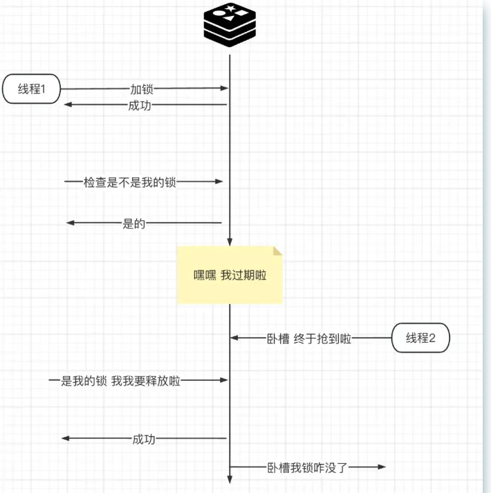
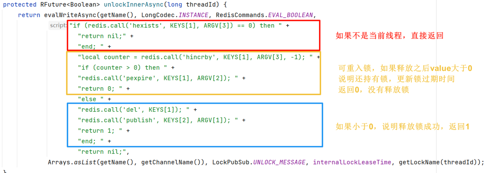
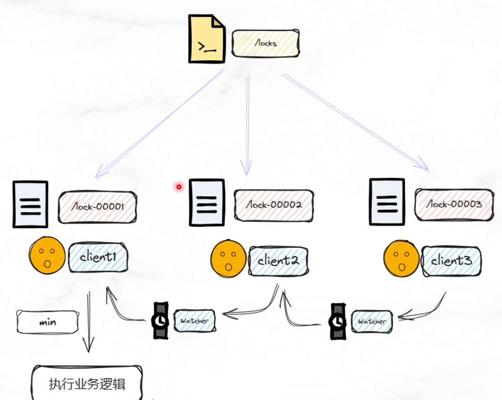
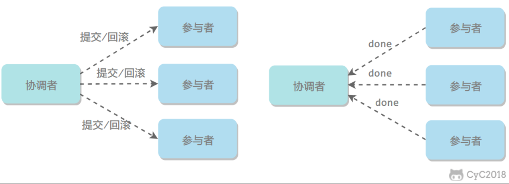
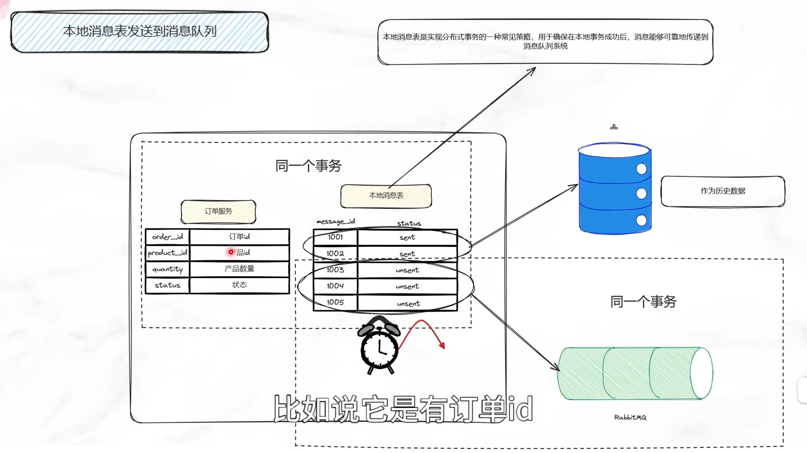
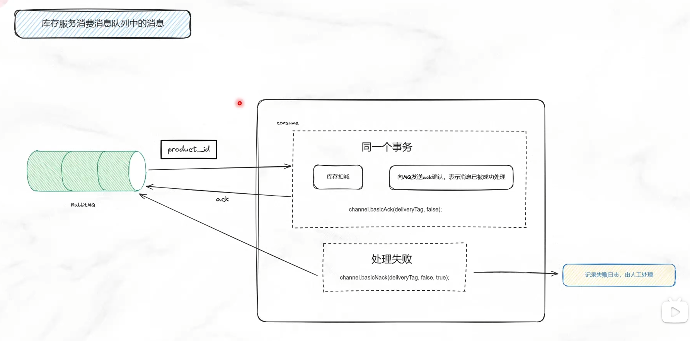
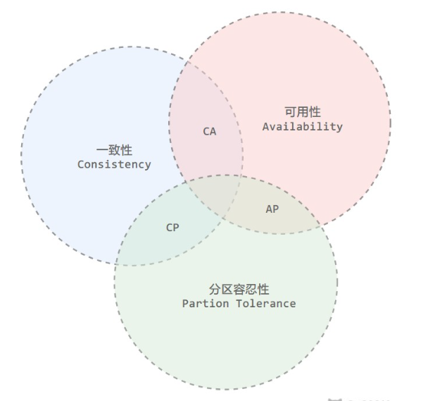
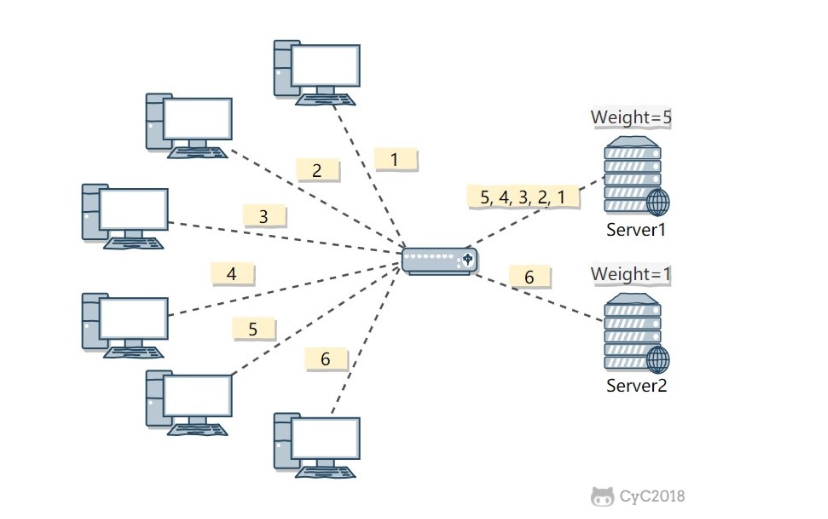

# 分布式相关

## 1.分布式锁

### 1.1 数据库的唯一索引

获得锁时向表中插入一条记录，释放锁时删除这条记录。唯一索引可以保证该记录只被插入一次，那么就可以用这个记录是否存在来判断是否处于锁定状态。

存在一些问题：

- 锁没有失效时间，解锁失败的话其他进程无法再获得锁
- 非阻塞锁，插入失败直接报错，无法重试
- 不可重入，已经获得锁的进程也必须重新获取锁。

### 1.2 Redis分布式锁

#### 2.1 单机分布式锁

锁的分类：

- 单机锁：同一个JVM虚拟机内，synchronized或者lock接口
- 分布式锁：锁不同的JVM虚拟机，单机锁不起作用，资源类在不同的服务器之间共享

普通的redis锁的加锁过程：

1.最简单的版本

set if not exist，如果存在key设置失败

```mysql
setnx key value 
```

存在的问题：持有锁的服务崩了，导致一直无法释放锁

2.使用Redis自带的原子命令,增加设置锁的过期时间：

```mysql
setnx key value nx ex 100
```

这个命令的作用如下：

- `SETNX key value`：如果 `key` 不存在，则设置 `key` 的值为 `value`。
- `NX`：此选项确保只有在 `key` 不存在的情况下才执行设置操作。
- `EX 100`：设置 `key` 的过期时间为 100 秒。

3.过期时间的设置和删掉别人的锁

对应的解决办法

- 锁的续约，看门狗机制
- 每个锁区分一下，保证锁不会被误删 UUID

4.判断锁是否属于自己和删除锁之间没有原子

先判断在删除，判断的时候确实是自己的，但是判断之后立马被别的线程设置锁，原本线程删除的时候，删了别人的锁



5.使用LUA脚本，保证判断和删除都是原子性的

```lua
"if redis.call('get', KEYS[1]) == ARGV[1] " +
"then " +
"return redis.call('del', KEYS[1]) " +
"else " +
"   return 0 " +
"end";
```

总结：

- **主要通过setnx方式，设置一个有过期时间并且和客户端相关的独特key**
- **解锁的过程：主要通过Lua脚本保证判断和删除操作的原子性，以此保证只能删除自己的锁。**

#### 2.2 Redisson

单机版还有无法解决的问题，

- 单机的redis直接挂掉，主从也无法解决 线程1先获得锁，将对应的key-value写入主机 master 在主机将该键值对同步到从机slave之前,发生故障

  redis触发转移，将其中一个slave设置为新的master 但是此时新的master根本不包含线程1的key-value 线程2这时候来获取锁，发现没有加锁。获取锁成功。

- 锁的过期时间的限制

基于Redission的分布式锁：

Redission是基于 **Redlock 的算法，是RedLock算法的Java实现**

**解决上述的主从问题**：Redission直接将所有的从机全部变为主机，一个加锁的key由多个redis客户端去维护，它会对集群中的每个 Redis，**挨个去执行设置 Redis 锁的脚本**，也就是集群中的每个 Redis 都会包含设置好的锁数据。

例如：将三个redis客户端全部设置为master，同时加锁。如果有一个出现意外，去其余两个获取锁。完成分布式多机锁。

**对于解决设置锁过期时间：通过看门狗机制**

客户端加锁成功，就会启动一个watch dog看门狗，他是一个后台线程，会每隔10秒检查一下，如果客户端还持有锁key，那么就会不断的延长锁key的生存时间，默认每次续命从30秒新开始 当30秒结束之后线程还没有续约，锁自动释放。避免了死锁的产生。



### 1.3 Zookeeper

#### Zookeeper的工作原理

Zookeeper的节点分为持久节点和临时节点。临时节点在客户端断开连接时会自动删除，而顺序节点会在节点名称后面附加一个递增的序号。通过组合这两种节点特性，可以实现分布式锁。

#### Zookeeper分布式锁的实现步骤

1. **创建节点**：每个客户端在尝试获取锁时，会在一个特定的目录下创建一个临时顺序节点。
2. **判断最小节点**：客户端获取当前目录下所有子节点，并判断自己是否是最小的节点。如果是，则表示获取锁成功。
3. **监视前一个节点**：如果当前节点不是最小节点，则监听比自己小的节点的删除事件。当前一个节点被删除时，再次判断自己是否是最小节点。
4. **释放锁**：当客户端完成任务后，删除自己创建的节点，表示释放锁。



**初始化ZooKeeper客户端**：通过ZooKeeper类连接Zookeeper服务器，并在锁根目录不存在时创建它。

**创建临时顺序节点**：在尝试获取锁时，创建一个临时顺序节点。

**获取锁的逻辑**：获取锁根目录下的所有子节点，并判断自己是否是最小的节点。如果是，则获取锁成功；否则，监听前一个节点的删除事件。

**释放锁**：删除自己创建的节点，以释放锁。

**羊群效应：**一个节点未获得锁，只需要监听自己的前一个子节点，这是因为如果监听所有的子节点，那么任意一个子节点状态改变，其它所有子节点都会收到通知（羊群效应，一只羊动起来，其它羊也会一哄而上），而我们只希望它的后一个子节点收到通知。


举个例子：

假设有三个客户端，分别创建了以下顺序节点：

- 客户端 A：`/lock_0001`
- 客户端 B：`/lock_0002`
- 客户端 C：`/lock_0003`

1. **客户端A**发现自己是最小节点，直接获取锁。
2. **客户端B**发现自己不是最小节点，它会监听`/lock_0001`的删除事件。
3. **客户端C**发现自己也不是最小节点，它会监听`/lock_0002`的删除事件。
4. **客户端A**在完成任务后释放锁，删除`/lock_0001`。
5. **客户端B**监听到`/lock_0001`被删除，解除阻塞并发现自己成为了最小节点，获取锁。
6. **客户端C**继续监听`/lock_0002`的删除事件。


基于Redis实现分布式锁

- 实现比较复杂
- 存在死锁的可能
- 性能比较好，基于内存 ，而且保证的是高可用，redis优先保证的是AP(分布式CAP理论)

基于Zookeeper实现分布式锁

- 实现相对简单
- 可靠性高，因为zookeeper保证的是CP(分布式CAP理论)
- 性能相对较好 并发1~2万左右，并发太高，还是redis性能好

## 2.分布式事务

### 2pc-两阶段提交

协调者询问参与者事务是否执行成功，参与者发回事务执行结果。询问可以看成一种投票，需要参与者都同意才能执行。



提交阶段：

如果事务在**每个参与者上都执行成功，事务协调者发送通知让参与者提交事务**；否则，协调者发送通知让参与者回滚事务。

需要注意的是，在准备阶段，参与者执行了事务，但是还未提交。只有在提交阶段接收到协调者发来的通知后，才进行提交或者回滚。

存在的问题：

同步阻塞：事务参与者等待其他事务响应的时候是阻塞的，无法进行其他的操作

单点的问题：事务协调者发生故障，导致一直同步阻塞

数字不一致：协调者发送了Commit消息，此时网络发生异常，只有部分参与者接收Commit消息，也就是说只有部分参与者提交了事务，使得系统数据不一致。

太过保守：任意一个节点失败就会导致整个事务失败，没有完善的容错机制。

### 3pc-三阶段提交

三阶段提交协议（3PC）是一种分布式算法，确保事务中的所有参与者要么全部提交事务，要么全部回滚事务，从而实现无阻塞的共识。与2PC相比，3PC通过增加一个**“预提交”**阶段进一步减少了阻塞的风险。

该协议包括三个阶段：

1. **CanCommit 阶段**：协调者向所有参与者发送 `canCommit` 请求，检查他们是否可以提交事务。
2. **PreCommit 阶段**：如果所有参与者都返回积极响应，协调者将发送 `preCommit` 请求，让所有参与者为提交事务做准备。
3. **DoCommit 阶段**：如果所有参与者都确认 `preCommit`，协调者发送 `doCommit` 请求，通知所有参与者最终提交事务。

### 本地消息表+MQ

本地消息表这种实现方式应该是业界使用最多的，其核心思想是将**分布式事务拆分成本地事务进行处理**，使用本地事务+消息队列的方式实现，实现解耦

1. 在分布式事务操作的一方完成写业务数据的操作之后向本地消息表发送一个消息，**本地事务能保证这个消息一定会被写入本地消息表中。**
2. 之后将本地消息表中的消息转发到消息队列中，如果转发成功则将消息从本地消息表中删除，否则继续重新转发。
3. 在分布式事务操作的另一方从消息队列中读取一个消息，并执行消息中的操作。

分布式事务A和本地消息表利用本地事务保证一致性：



分布式事务B和确认消费保证



举例


**1. 业务处理：** 业务处理时通常进行db变更

**2. 将业务变更信息插入记录表**：在业务逻辑中，当需要发送消息时，首先将消息插入到本地消息表中，设置状态为待发送。

**3. 发送消息**，1、2、3步骤在同一个本地事务中。如果本地事务执行成功，提交本地事务和消息表的记录；如果本地事务失败，回滚本地事务和消息表的记录。

**3.1,3.2. 消息确认机制：**

单独创建一个后台线程或定时任务，定时扫描本地消息表中状态为待发送的消息，并将这些消息发送到消息队列。在成功发送到消息队列后，将消息表中对应的状态修改为已发送。此外，可以根据需要实现消息发送失败后的重试机制。

**4. B系统消费消息：**

消费者监听消息队列，解析消息内容。

**5. B系统进行业务逻辑处理：**

进行业务逻辑处理，更改DB。**此步骤必须要保证幂等性**。

**4、5 如果失败依赖`3.1、3.2`的定时投放**

**6. 确认消费完成：**

当消息消费完成后，调用A系统进行状态变更

**6、7如果失败相当于两个分布式系统的数据已经一致了，但是本地消息表的状态还是错的。这种情况下借助`3.1、3.2`的重新投放策略，让下游幂等处理再更改消息表的状态也能解决。或者A系统也可以查询B系统的处理状态，如果成功直接更改状态**


## 3.CAP理论

分布式系统不可能同时满足一致性（C：Consistency）、可用性（A：Availability）和分区容忍性（P：Partition Tolerance），最多只能同时满足其中两项。



### 一致性

一致性指的是多个数据副本是否能保持一致的特性，在一致性的条件下，系统在执行数据更新操作之后能够从一致性状态转移到另一个一致性状态。

**对系统的一个数据更新成功之后，如果所有用户都能够读取到最新的值，该系统就被认为具有强一致性**。

### 可用性

可用性指分布式系统在面对各种异常时可以提供正常服务的能力，可以用系统可用时间占总时间的比值来衡量，**4个9的可用性表示系统 99.99% 的时间是可用的**。在可用性条件下，要求系统提供的服务一直处于可用的状态，**对于用户的每一个操作请求总是能够在有限的时间内返回结果。**

### 分区容忍性

网络分区指分布式系统中的节点被划分为多个区域，每个区域内部可以通信，但是区域之间无法通信。

在分区容忍性条件下，**分布式系统在遇到任何网络分区故障的时候，仍然需要能对外提供一致性和可用性的服务，除非是整个网络环境都发生了故障**。

### 权衡

在分布式系统中，分区容忍性必不可少，因为需要总是假设网络是不可靠的。因此，CAP 理论实际上是要在可用性和一致性之间做权衡。

p是一定有的，但是一致性和可用性是冲突的，无法同时满足

- 为了保证一致性（CP），**不能访问未同步完成的节点，也就失去了部分可用性**；
- 为了保证可用性（AP），**允许读取所有节点的数据，但是数据可能不一致**。


## 4.幂等性

什么是幂等性？同一个接口调用多次，造成的结果是一样的

常见的造成幂等性的原因：

- 接口返回值较慢，用户重复点击
- 各种重试机制

常见的幂等性两大场景：

- 单数据CRUD的幂等性方案
- 多数据并发的幂等性方案

### 4.1 基础方案

#### 全局唯一ID

如果使用全局唯一ID，就是**根据业务的操作和内容生成一个全局ID**，在执行操作前先根据这个全局唯一ID是否存在，来判断这个操作是否已经执行。

如果不存在则把全局ID，存储到存储系统中，比如数据库、Redis等。如果存在则表示该方法已经执行。

使用全局唯一ID是一个通用方案，可以支持插入、更新、删除业务操作。

一般情况下，对分布式的全局唯一id，可以参考以下几种方式：

- UUID
- Snowflake
- 数据库自增ID
- 业务本身的唯一约束
- 业务字段+时间戳拼接

#### 唯一索引（去重表）

这种方法适用于在业务中有唯一标识的插入场景中，比如在以上的支付场景中，如果一个订单只会支付一次，所以**订单ID可以作为唯一标识**。

这时，我们就可以建一张去重表，并且把唯一标识作为唯一索引，在我们实现时，把创建支付单据写入去重表，放在一个事务中，**如果重复创建，数据库会抛出唯一约束异常**，操作就会回滚。

#### 状态机控制

这种方法适合在有状态机流转的情况下，比如就会订单的创建和付款，订单的付款肯定是在之前，这时我们可以通过在**设计状态字段时**，使用int类型，并且通过值类型的大小来做幂等，比如订单的创建为0，付款成功为100，付款失败为99。

### 4.2 分布式幂等性

综合性的解决方案：一锁二判三更新

简单来说就是当任何一个并发请求过来的时候

- 1. 先锁定单据
- 2. 然后判断单据状态，是否之前已经更新过对应状态了
- 3.1  如果之前并没有更新，则本次请求可以更新，并完成相关业务逻辑。
- 3.2  如果之前已经有更新，则本次不能更新，也不能完成业务逻辑。

#### 一锁、二判、三更新的核心步骤

##### 第一步：先加锁。

高并发场景，建议是redis分布式锁，而不是低性能的DB锁，也不是CP型的 Zookeeper锁。

如果普通的redis分布式锁性能太低，该如何？

还可以考虑引入 锁的分段机制， 比如内部分成100端，总体上，就大概能线性提升 100倍。

##### 第二步：进行幂等性判断。

幂等性判断，就是 进行 数据检查。

可以基于状态机、流水表、唯一性索引等等前面介绍的 基础方案，进行重复操作的判断。

##### 第三步：数据更新

如果通过了第二步的幂等性判断， 说明之前没有执行过更新操作。

那么就进入第三步，进行数据的更新，将数据进行持久化。

操作完成之后， 记得释放锁， 结束整个流程。

## 5.负载均衡

### 概念

集群中的应用服务器（节点）通常被设计成无状态，用户可以请求任何一个节点。

负载均衡器会根据集群中每个节点的负载情况，将用户请求转发到合适的节点上。

负载均衡器可以用来实现高可用以及伸缩性：

- 高可用：当某个节点故障时，负载均衡器会将用户请求转发到另外的节点上，从而保证所有服务持续可用；
- 伸缩性：根据系统整体负载情况，可以很容易地添加或移除节点。

负载均衡器运行过程包含两个部分：

1. 根据负载均衡算法得到转发的节点；
2. 进行转发

### 负载均衡算法

#### 1.轮询算法

轮询算法把每个请求轮流发送到每个服务器上。

下图中，一共有 6 个客户端产生了 6 个请求，这 6 个请求按 (1, 2, 3, 4, 5, 6) 的顺序发送。(1, 3, 5) 的请求会被发送到服务器 1，(2, 4, 6) 的请求会被发送到服务器 2。

该算法比较适合每个服务器的性能差不多的场景，如果有性能存在差异的情况下，那么性能较差的服务器可能无法承担过大的负载。

#### 2.加权轮询

加权轮询是在轮询的基础上，根据服务器的性能差异，为服务器赋予一定的权值，性能高的服务器分配更高的权值。

服务器 1 被赋予的权值为 5，服务器 2 被赋予的权值为 1，那么 (1, 2, 3, 4, 5) 请求会被发送到服务器 1，(6) 请求会被发送到服务器 2。



#### 3.最少连接

最少连接算法就是将请求发送给当前最少连接数的服务器上。

#### 4.加权最少连接

在最少连接的基础上，根据服务器的性能为每台服务器分配权重，再根据权重计算出每台服务器能处理的连接数。

#### 5.随机算法

把请求随机发送到服务器上。

和轮询算法类似，该算法比较适合服务器性能差不多的场景。

#### 6.源地址哈希法

源地址哈希通过对客户端 IP 计算哈希值之后，再对服务器数量取模得到目标服务器的序号。

可以保证同一 IP 的客户端的请求会转发到同一台服务器上，用来实现会话粘滞（Sticky Session）