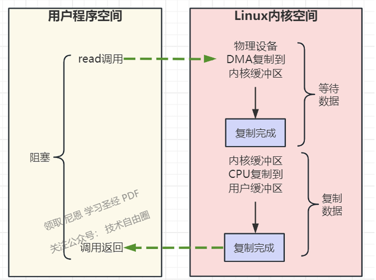
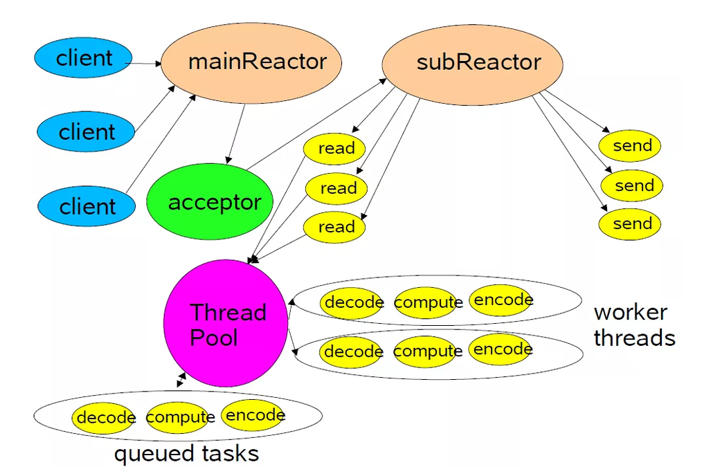

# 国网隧道通信

## 1.IO模型

### 1.0 基础知识

#### **用户态和内核态**

用户态和内核态，在操作系统中防止应用程序错误或者恶意操作，分为用户态和内核态，通过 **系统调用（System Call）** 将执行权限从用户态切换到内核态。例如，应用程序需要读写文件、分配内存时，它会发起系统调用，由操作系统内核完成具体操作。

#### **数据传输过程**

网卡上的数据到达用户程序空间分为两个阶

- 数据准备阶段：网络数据包到达网卡，通过DMA（专门的辅助芯片）方式将数据包拷贝到内存中，然后经过硬中断，软中断，接着通过内核线程 ksoftirqd 经过内核协议栈的处理，最终将数据发送到**内核Socket的接收缓冲区 receive buffer**中。 
- 数据拷贝阶段：当数据到达内核Socket的receive buffer 接收缓冲区中时，此时数据存在于内核空间中，需要将数据拷贝到用户空间中，才能够被应用程序读取。

#### **同步和异步 阻塞和非阻塞**

首先同步和异步，是针对应用程序（如Java）与内核的交互过程的方向而言的

同步类型的IO操作，发起方是应用程序，接收方是内核。 同步IO由应用进程发起IO操作，并阻塞等待，或者轮询的IO操作是否完成。

 异步IO操作，应用程序在**提前注册完成回调函数之后去做自己的事情**，IO交给内核来处理，在内核完成IO操作以后，**启动进程的回调函数**

阻塞与非阻塞，关注的是用**户进程在IO过程中的等待状态**。

前者用户进程需要为IO操作去阻塞等待，而后者用户进程可以不用为IO操作去阻塞等待。

同步阻塞型IO、同步非阻塞IO、多路IO复用，都是同步 IO，也是阻塞性IO。

**阻塞与非阻塞的本质区别：如果receive buffer没有数据的话，怎么办？**

在第一阶段，当Socket的接收缓冲区中没有数据的时候，**阻塞模式下，IO线程会一直等待**，一直干等，不能不干别的。注意，线程资源是宝贵的，如果IO连接越多，线程资源就会耗光。  

非阻塞 模式下IO线程不会等待，系统调用直接返回错误标志EWOULDBLOCK 。为了读到数据，非阻塞模式下， IO线程需要一致轮询。当然，也可以先去干别的事情，过一会再来轮询。 

在第二阶段，当Socket的接收缓冲区中有数据的时候， 阻塞和非阻塞的表现是一样的，都会进入CPU数据复制操作，数据从内核空间拷贝到用户空间，然后系统调用返回

**同步与异步的区别,  主要在第二阶段：数据拷贝阶段，主要是数据拷贝`发起方`不同**

数据拷贝属于cpu复制， 主要是将数据从内核空间Socket接收缓冲区，拷贝到用户空间的 字节数组

- IO线程：io线程发起数据拷贝-同步
- 内核线程：内核线程发起数据拷贝-异步

#### 文件描述符

文件描述符（File Descriptor）是内核为了高效管理已被打开的文件所创建的索引，它是一个非负 整数（通常是小整数），用于指代被打开的文件。所有的IO系统调用，包括socket的读写调用，都是通 过文件描述符完成的。

### 1.1 BIO-同步阻塞IO模型

在阻塞式IO模型中，Java应用程序从**发起IO系统调用开始，一直到系统调用返回，在这段时间内，发起 IO请求的Java进程（或者线程）是阻塞的**。直到返回成功后，应用进程才能开始处理用户空间的缓存区数据

### 1.2 NIO-同步非阻塞IO模型

- 在**内核缓冲区中没有数据的情况下，系统调用会立即返回，返回一个调用失败的信息**。 
- 在内核缓冲区中有数据的情况下，在数据的复制过程中系统调用是阻塞的，直到完成数据从内核 缓冲复制到用户缓冲。复制完成后，系统调用返回成功，用户进程（或者线程）可以开始处理用户空间 的缓存数据

同步非阻塞IO的优点：每次发起的IO系统调用，在内核等待数据过程中可以立即返回。用户线程不会阻塞，实时性较好

### 1.3 IO多路复用

如何避免同步非阻塞IO模型中轮询等待的问题呢？将轮询操作直接在内核空间完成。这就是IO多路复用模型。

在IO多路复用模型中，引入了一种新的系统调用，查询IO的就绪状态。在Linux系统中，对应的系统调 用为select/poll/epoll系统调用

（1）选择器注册。首先将需要sys_read操作的目标文件描述符（socket连接），提 前注册到Linux的select/epoll选择器中，在Java中所对应的选择器类是Selector类。然后，才可以开启 整个IO多路复用模型的轮询流程。

（2）内核就绪状态的轮询。**通过选择器的查询方法，查询所有的提前注册过的目标文件描述符（socket连接）的IO就绪状态**。通过查询的**`系统调用`**，内核会返回一个**就绪的socket列表**。当任何一个注册过的 socket中的数据准备好或者就绪了，就是内核缓冲区有数据了，内核就将该socket加入到就绪的列表中，并且返回就绪事件。 

（3）用户线程获得了就绪状态的列表后，根据其中的socket连接，发起sys_read系统调用，用户线程阻塞。内核开始复制数据，将数据从内核缓冲区复制到用户缓冲区。 

（4）复制完成后，内核返回结果，用户线程才会解除阻塞的状态，用户线程读取到了数据，继续执行。

IO多路复用本质上也是一种同步阻塞的IO，本质上，select/epoll系统调用是阻塞式的，属于同步阻塞IO。都需要在读写事件就绪后，由系统调用本身负责进行读写，也就是说这个事件的查询过程是阻塞的

### 1.4  信号驱动IO模型

在信号驱动IO模型中，用户线程通过向核心注册IO事件的回调函数，来避免IO时间查询的阻塞

信号驱动IO的基本流程是：用户进程通过系统调用，向内核注册SIGIO信号的owner进程和以及进程内 的回调函数。内核IO事件发生后（比如内核缓冲区数据就位）后，通知用户程序，用户进程通过 sys_read系统调用，将数据复制到用户空间，然后执行业务逻辑。

### 1.5 异步IO模型（Asynchronous IO）

AIO的基本流程是：用户线程通过系统调用，向内核 注册某个IO操作。内核在整个IO操作（包括数据准备、数据复制）完成后，通知用户程序，用户执行后 续的业务操作。 在异步IO模型中，在整个内核的数据处理过程中，包括内核将数据从网络物理设备（网卡）读取到内核 缓冲区、将内核缓冲区的数据复制到用户缓冲区，用户程序都不需要阻塞。

## 2.操作系统底层

### 2.1 **网卡接收数据到应用程序的过程**

- **数据从外部达到网卡**
- **网卡把数据DMA到内存**
- **网卡通过硬中断通知cpu （中断分为软中断和硬中断）**
- **cpu响应硬中断，发出软中断，调用网卡驱动程序**
- 中断程序先将网络数据写入到对应 Socket 的接收缓冲区里面
- **唤醒被阻塞的用户程序**

socket数据包格式（**源ip，源端口，协议，目的ip，目的端口**） 一般通过目的ip，目的端口 就可以识别出来接收到的网络数据属于哪个socket。

## 3.IO多路复用

多路：尽可能少的线程来处理尽可能多的连接，这里的多路，指的就是需要处理的连接。（BIO单路）

复用：线程的复用

IO多路复用进行了一次大解耦，把IO事件（可以操作状态）和IO的操作进行剥离，解耦出一个**独立的系统调用， 查询IO事件（可以操作状态）**

剩下的read、write等系统调用， 仅仅在有事件的情况下， 去进行和IO的操作(读或者写）

多路复用在Linux内核代码迭代过程中依次支持了三种调用

- select
- poll
- epoll

### 3.1 select 系统调用

首先用户线程在发起select系统调用的时候会阻塞在select系统调用上。此时，用户线程从用户态切换到了内核态完成了一次上下文切换

用户线程将需要监听的Socket对应的文件描述符fd数组通过select系统调用传递给内核。此时，用户线程将用户空间中的文件描述符fd数组拷贝到内核空间

操作系统把进程 A 分别加入需要轮询的Socket 的等待队列中

当任何一个socket收到数据后，中断程序将唤起进程。

- 将网卡的数据拷贝到内核缓冲区文件描述符改为已就绪
- 根据文件描述符将数据拷贝到对应的数据接收队列
- 修改内核态的bitmap数组，将已经就绪的设置为1
- 将数组拷贝给用户态，返回信息，返回的就绪文件的个数
- 唤醒进程等待队列中的进程

select的缺点：

- 单个进程有最大连接数的限制 1024
- 每次调用select都需要将fds列表传递给内核，需要进行一次复制，有一定的开销。 每次调用select完成后，都必须把fd集合从内核空间拷贝到用户空间，这也有一定的开销，这个开 销在fd很多时会很大
- select不会告诉用户线程到底是哪些**Socket上发生了IO就绪事件**，只是对IO就绪的Socket作了标记， 用户线程依然要遍历文件描述符集合，去查找具体IO就绪的Socket
- 以上select的不足所产生的性能开销都会随着并发量的增大而线性增长。 很明显select也不能解决C10K问题，只适用于1000个左右的并发连接场景。

### 3.2 poll 系统调用

poll其实内部实现基本跟select一样，区别在于它们底层组织fd[]的数据结构不太一样，从而实现了poll 的最大文件句柄数量限制去除了。

只不过是将pollfds[]的结构体数组拷贝到内核进行遍历。内核还是在遍历遍历数组，查看pollfd中的revents是否为1

poll的缺点：

- 没有大小的现在，其余是一样的

### 3.3 epoll 系统调用

一次select调用，将“维护等待队列(事件监听)”和“阻塞等待（事件查询）”两个步骤合二为一，紧密耦合

- 第1次：每次调用select都需要将fds列表传递给内核，有一定的开销。进程加入socket的等待队列 时，需要遍历所有socket。 
- 第2次：当进程A被唤醒后，唤醒后需要从所有的socket的等待队列中移除。

epoll则**“事件注册”和“事件查询”**两个步骤进行解耦，一分为二，

 如何优化：

- epoll 将这两个操作分开，先用 **epoll_ctl 维护等待队列**，再调用 **epoll_wait 阻塞进程**
- 引入了就绪列表rdlist ，存储已经发生了io 事件的文件描述符

epoll的三个方法

- epoll_create：内核会创建一个 eventpoll 对象（专用的文件描述符，也就是程序中 epfd 所代 表的对象） eventpoll 对象也是文件系统中的一员，和 socket 一样，它也会有等待队列
- epoll_ctl：事件注册，添加待监控的socket 如果通过 epoll_ctl 添加 sock1、sock2 和 sock3 的监视，内核会将三个 socket 添加到 eventpoll  监听队列，，eventpoll 内部使用了一棵红黑树。通过这棵树来管理用户进程下添加进来的所有 socket 连 接。
- epoll_wait：事件查询，阻塞等待 进程 A 运行到了 epoll_wait 语句之后，进程A会等待eventpoll的等待队列。 会阻塞调用进程，直到注册的文件描述符中的一个或多个发生了指定的 I/O 事件（如可读、可写或异常）

先用 epoll_create 创建一个 epoll 对象 epfd ，再通过 epoll_ctl 将需要监视的 socket  添加到 epfd 的专用等待列表中，最后调用epoll_wait 等待数据，返回rdlist列表中的就绪socket。

epoll_wait处理过程 

- 数据包到达，触发 `socket` 的数据就绪回调。如果数据就等待
- 回调函数将 `socket` 加入 `epoll` 的就绪队列。
- 如果有进程在 `epoll_wait` 上阻塞，内核唤醒该进程，并通知它哪些 `socket` 已经准备好进行 I/O 操作。

优点：

- IO效率不随FD数目增加而线性下降：epoll它只会对"活跃（发生了io事件的fd）"的socket进行操作
- epoll通过内核和用户空间共享一块内存来实现的，从而避免了海量的文件描述符集合在用户空间和内核空间中来回复制。
- epoll仅会通知IO就绪的socket。避免了在用户空间遍历的开销
- epoll通过在socket的等待队列上注册回调函数**ep_poll_callback**通知用户程序IO就绪的socket。避 免了在内核中轮询的开销

## 4.Reactor的线程模型

Reactor是利用NIO对IO线程进行不同的分工

- 使用前边我们提到的IO多路复用模型比如select,poll,epoll,kqueue,进行IO事件的注册和监听。 
- 将监听到就绪的IO事件分发dispatch到各个具体的处理Handler中进行相应的IO事件处理。

### 4.1 单Reactor单线程

单Reactor意味着只有一个epoll对象，用来监听所有的事件，比如连接事件，读写事件。 单线程意味着只有一个线程来执行epoll_wait获取IO就绪的Socket，然后对这些就绪的Socket执行 读写，以及后边的业务处理也依然是这个线程

### 4.2 单Reactor多线程

这种模式下，也是只有一个epoll对象来监听所有的IO事件，一个线程来调用epoll_wait获取IO就 绪的Socket。 但是当IO就绪事件产生时，这些IO事件对应处理的业务Handler，我们是通过线程池来执行。这样 相比单Reactor单线程模型提高了执行效率，充分发挥了多核CPU的优势。

### 4.3 主从Reactor多线程

主 Reactor 主要负责监听网络事件（如连接请求），当有新的连接事件发生时，将这些连接分发给从 Reactor 进行后续的读写事件处理。

从 Reactor 负责具体的 I/O 读写事件处理，比如读数据、写数据、关闭连接等操作。

### 4.4 Netty的线程模型

Reactor在netty中是以group的形式出现的，netty中将Reactor分为两组，一组是 MainReactorGroup也就是我们在编码中常常看到的EventLoopGroup bossGroup,另一组是 SubReactorGroup也就是我们在编码中常常看到的EventLoopGroup workerGroup。

