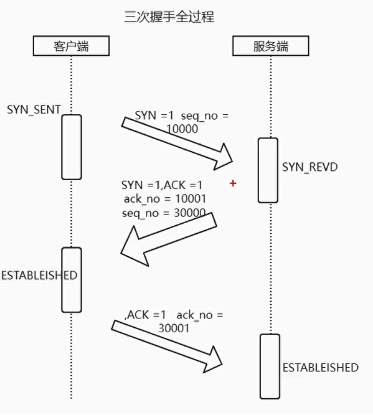
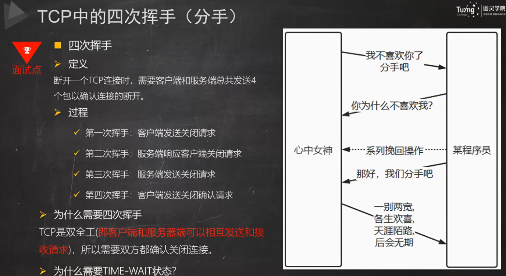

# 计算机基础知识

## 1.操作系统

### 1.1 进程和线程的区别

电脑上任务管理器里面每个都是进程，一个进程里面包含多个线程，线程共享进程的资源

**进程**：是操作系统中资源分配的基本单位，拥有独立的资源和地址空间。操作系统为每个进程分配资源，线程是进程的一部分，线程之间共享进程的资源

**进程**：进程之间相互独立，一个进程的崩溃不会影响其他进程的运行。例如，如果一个进程出现崩溃，其他进程可以继续正常运行。

**线程**：线程之间共享进程资源，如果一个线程发生错误，可能会影响整个进程的稳定性，导致所有线程都被迫停止。

就比如浏览器就是一个进程，然后可能画面渲染就是一个线程、还有我用户的输入也是可能线程

### 1.2 Linux中进程的通信方式

管道

信号

消息队列

共享内存

信号量

socket套接字

### 1.3 虚拟地址和物理地址

物理地址：实际内存上的地址

虚拟地址：每个进程都有自己独立的虚拟地址空间，操作系统通过地址转换机制将虚拟地址映射到实际的物理地址。

## 2.计算机网络

### 2.1 网络模型

OSI七层模式

- 应用层 http协议，为应用提高服务
- 表示层 数据格式转换、数据加密
- 会话层 建立管理会话
- 传输层 TCP/UDP协议 建立维护端到端的连接
- 网络层 IP IP地址的选择和路由
- 数据链路层 访问介质和链路
- 物理层 

**`TCP/IP五层模式`**-实际使用的

- 应用层
- 传输层
- 网络层
- 数据链路层
- 物理层

### 2.2 三次握手和四次挥手

三次握手的过程：

SYN:TCP报文的一个bit seq_no 序列号

SYN_SENT：SYN = 1 seq_no =1000

SYN_REVD:SYN = 1 ACK = 1 ack_no = 10001 seq_no = 30000

ESTABLISHED:ACK = 1 ack_no = 30001

`为什么需要三次握手？`

实现可靠：TCP的双方都需要维护一个序列号 **seq_no** 

二次握手：**客户端可以确认序列号被服务端收到，但是服务端不确定，客户端的序列号是否收到**

四次握手：三次序列号双方已经可以确认了

`SYN的洪泛攻击：` 将TCP的用于三次握手建立连接的队列撑满

四次挥手：

需要双方都关闭连接

### 2.3 长短连接

TCP是长链接

tcp只是帮忙建立连接，受应用层协议的影响

**`连接是不是复用载体，长连接就是请求复用连接`**

http1.0 1.1 没有开启keeoalive 连接只负责一次同步阻塞的请求+响应 短链接

http1.0 1.1 开启keeoalive 同步复用连接：多次（请求+响应）

常见的长连接：

- websocket
- http1.0 1.1 开启keepalive

常见的短连接：

- REST API
- FTP
- SMTP

请求首部

| 首部字段名      |           说明            | 常见的值                                        |
| --------------- | :-----------------------: | ----------------------------------------------- |
| Accept          | 用户代理可处理的媒体类型  | text/html,application/xhtml+xml,application/xml |
| origin          |          请求源           | https://github.com                              |
| Accept-Encoding |      优先的内容编码       | gzip, deflate, br, zstd                         |
| Accept-Language |  优先的语言（自然语言）   | zh-CN,zh;q=0.9,en;q=0.8,en-GB;                  |
| Authorization   |       Web 认证信息        | Token信息                                       |
| User-Agent      |   HTTP 客户端程序的信息   | 设备信息                                        |
| Referer         | 对请求中 URI 的原始获取方 | www.baidu.com                                   |
| Host            |    请求资源所在服务器     | www.baidu.com                                   |
| cookie          |       用户信息缓存        | SessionID = XXX                                 |

响应首部

| 首部字段名       |                             说明                             | 常见的值                                                |
| ---------------- | :----------------------------------------------------------: | ------------------------------------------------------- |
| Content-Type     | 指定响应的媒体类型（MIME 类型），告诉客户端如何解析响应内容。 | ttext/html`, `application/json`, `text/css`, `image/png |
| Content-Length   |  响应内容的字节长度，用于指示客户端从服务器接收数据的长度。  | `3482` (字节大小)                                       |
| Set-Cookie       |                  用于会话管理或保存状态信息                  | sessionid=abc123;                                       |
| **Connection**   | 控制当前 TCP 连接的处理方式，决定是否保持连接以进行后续请求  | keep-alive`, `close                                     |
| content-encoding |                        优先的内容编码                        | gzip, deflate, br, zstd                                 |
| Date             |                     响应生成的日期和时间                     | Mon, 27 Sep 2024 10:00:00 GMT                           |
| Last-Modified    |    指定服务器端资源最后一次修改的时间，用于缓存和条件请求    | Wed, 27 Sep 2023 10:00:00 GMT                           |

## 3.web加载到页面展示

### 3.1 DHCP获取ip地址的过程

DHCP报文向路由器申请ip地址，会先生成一个DHCP报文

- 源ip 0.0.0.0 目的ip 255.255.255.255
- 源MAC 本机MAC 目的MAC：FF:FF:FF:FF:FF:FF

它需要在网络层中广播，从而传达网络中所在的路由器,当路由器收到广播之后，它挑选了合适的IP地址，并将其他信息，一起放入DHCP报文，路由器在链路层中可以直接指定投递的MAC地址，在网络层中广播的形式在传递。

网络中可能会存在多个路由器同时挑选IP地址给主机。因此在番茄收到了DHCP报文后，它需要从中挑选一个，并回复所有的路由器它的选择。因此它仍然要通过广播的方式在网络层和链路层传递回复的消息。当路由器收到广播，如果主机选择的不是自己，则无视。如果主机选择的是自己，则实际将该IP地址分配给番茄，并且回复。注意此时番茄仍然没有IP地址，因此路由器仍然要通过广播的方式在网络层中传递。

当番茄收到了回复后，将IP地址及其他信息记录下来，至此它拥有了自己的IP地址。（尽管这是临时的，因为DHCP协议还附带有租期）

### 3.2 ARP解析MAC地址

DHCP 过程只知道网关路由器的 IP 地址，为了获取网关路由器的 MAC 地址，需要使用 ARP 协议。

通过网关路由器的IP地址构建ARP协议，在网络层广播，网关路由器接收到该帧后，不断向上分解得到 ARP 报文，发现其中的 IP 地址与其接口的 IP 地址匹配，因此就发送一个 ARP 回答报文，包含了它的 MAC 地址，发回给主机。

### 3.3 DNS域名解析

域名的层级关系类似一个树状结构：

- 根DNS服务器(.)
- 顶级域DNS服务器(.com)
- 权威DNS服务器(server.com)

1. 客户端首先会发出一个 DNS 请求，问 www.server.com 的 IP 是啥，并发给本地 DNS 服务器（也就是客户端的 TCP/IP 设置中填写的 DNS 服务器地址）。
2. 本地域名服务器收到客户端的请求后，如果缓存里的表格能找到 www.server.com，则它直接返回 IP 地址。如果没有，本地 DNS 会去问它的根域名服务器：“老大， 能告诉我 www.server.com 的 IP 地址吗？” **根域名服务器是最高层次的，它不直接用于域名解析，但能指明一条道路。**
3. 根 DNS 收到来自本地 DNS 的请求后，发现后置是 .com，说：“www.server.com 这个域名归 .com 区域管理”，我给你 .com 顶级域名服务器地址给你，你去问问它吧。”
4. 本地 DNS 收到顶级域名服务器的地址后，发起请求问“老二， 你能告诉我 www.server.com 的 IP 地址吗？”
5. 顶级域名服务器说：“我给你负责 www.server.com 区域的权威 DNS 服务器的地址，你去问它应该能问到”。
6. 本地 DNS 于是转向问权威 DNS 服务器：“老三，www.server.com对应的IP是啥呀？” server.com 的权威 DNS 服务器，它是域名解析结果的原出处。为啥叫权威呢？就是我的域名我做主。
7. 权威 DNS 服务器查询后将对应的 IP 地址 X.X.X.X 告诉本地 DNS。
8. 本地 DNS 再将 IP 地址返回客户端，客户端和目标建立连接。

首先本地域名服务器向根域名服务器发起请求，根域名服务器返回顶级域名服务器的地址给本地服务器 

本地域名服务器拿到这个顶级域名服务器的地址后，就向其发起请求，获取权限域名服务器的地址 

本地域名服务器根据权限域名服务器的地址向其发起请求，最终得到该域名对应的 IP 地址 

本地域名服务器将得到的 IP 地址返回给操作系统，同时自己将 IP 地址缓存起来

### 3.4 TCP三次握手

经历了三次握手，在三次握手的最后一个ACK附带上自己的请求资源。至此TCP连接建立完成

### 3.5 发送http报文

接建立之后，浏览器生成 HTTP GET 报文，并交付给 HTTP 服务器。

HTTP 服务器从 TCP 套接字读取 HTTP GET 报文，生成一个 HTTP 响应报文，将 Web 页面内容放入报文主体中，发回给主机。

浏览器收到 HTTP 响应报文后，抽取出 Web 页面内容，之后进行渲染，显示 Web 页面。
